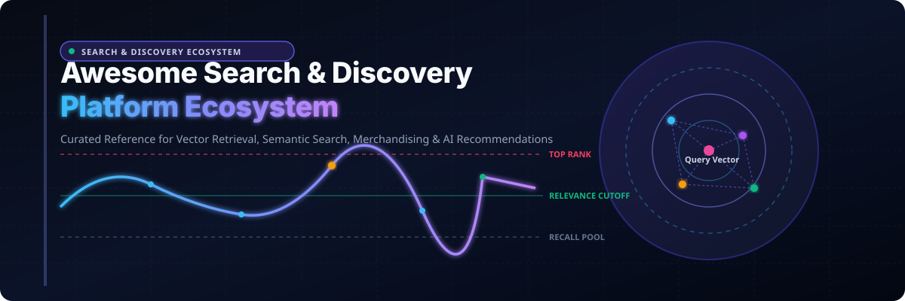

<p align="center">
  
</p>

<p align="center">
  <a href="https://github.com/ishandutta2007/Awesome-Awesome-Awesome"></a>
  <a href="https://discord.gg/jc4xtF58Ve"></a>
  <a href="https://github.com/ishandutta2007/Awesome-Search-n-Discovery-Platform/stargazers"></a>
  <a href="https://github.com/ishandutta2007/Awesome-Search-n-Discovery-Platform/network/members"></a>
  <a href="https://github.com/ishandutta2007"></a>
</p>

# 🔍 Awesome Search & Discovery Platform

> **A comprehensive, SEO-optimized reference ecosystem of enterprise SaaS / Hosted Search Suites and Open-Source GitHub Projects covering E-Commerce Search, Product Discovery, Site Search, Full-Text Indexing, Semantic Vector Retrieval, Personalization, Recommender Systems, AI Merchandising, and RAG Architecture.**
>
> *Last updated: September 2026* 📅

---

## 📌 Ecosystem Overview & Market Dynamics

Search & Discovery platforms help digital storefronts, marketplaces, enterprise intranets, and SaaS applications connect users with relevant products and content at sub-50ms speeds. Modern search engines unify **lexical inverted indices (BM25)** with **dense vector embeddings**, **hybrid retrieval**, **query understanding** (intent classification, entity recognition, spellcheck, synonym expansion), and **business merchandising rules** (pinning, boosting, burying, banners).

### 📊 Sector Market Size & Industry Concentration
> 💡 **Estimated Market Size**: The global Search, Recommendation, and Product Discovery Software market is estimated at **~$12.5 Billion in 2026** and projected to reach **~$25.8 Billion by 2032**, compounding at a robust **12.8% CAGR** propelled by neural search, generative AI shopping assistants, and headless commerce architectures.
>
> 🎯 **Market Concentration**: The sector exhibits **moderate fragmentation with dual-tier concentration dynamics**. Foundational developer search infrastructure and cloud API search are **highly concentrated** around market anchors (such as **Elastic**, **Algolia**, and cloud hyperscalers AWS, Google Cloud, and Azure). Conversely, vertical retail product discovery, visual commerce, and merchandising layers are **moderately fragmented** among specialized platforms (including **Bloomreach**, **Constructor**, **Coveo**, **Searchspring**, **Nosto**, **Klevu**, and **Luigi's Box**), where heterogeneous CMS/cart integrations (Shopify, Adobe Commerce/Magento, WooCommerce, SAP) preserve competitive diversity.

---

## 📑 Table of Contents

- [💼 SaaS / Hosted Platforms (Sorted by Company Size)](#-saas--hosted-platforms-sorted-by-company-size)
- [⚡ Open-Source GitHub Projects (Sorted by Star Count)](#-open-source-github-projects-sorted-by-star-count)
- [🏗️ Architecture for Custom Search & Discovery Platforms](#️-architecture-for-custom-search--discovery-platforms)
- [🔄 Key Search & Discovery Workflows](#-key-search--discovery-workflows)
- [📊 Capability Matrix](#-capability-matrix)
- [📈 Star History](#-star-history)
- [🤝 How to Contribute](#-how-to-contribute)
- [⚠️ Disclaimer](#️-disclaimer)

---

## 💼 SaaS / Hosted Platforms (Sorted by Company Size)

Commercial, hosted, or enterprise-oriented search, product discovery, personalization, and merchandising platforms.

*Note: The table below is sorted by **Company Size / Revenue / Valuation (Descending)**.* ⬇️

| Platform / Product | Description / Primary Model | Main Strength | Pricing (Starting Tier) 💵 | Free Tier / Free Trial Limit 🎁 | Company Size (Revenue / Valuation) 🏢 |
| :--- | :--- | :--- | :--- | :--- | :--- |
| **[Dynamic Yield](https://www.dynamicyield.com/)** 💳 | Personalization & Experience Optimization | Recommendations + real-time experimentation | Starts at ~$35,000/year (or ~$2,900/month; enterprise annual subscription scaling with MUVs) | 14-day to 30-day proof-of-concept / sandbox API evaluation (limited to staging environment and 100k test sessions) | **~$430B** Parent Market Cap (Mastercard - NYSE: MA) / ~$70M division revenue |
| **[Elastic Search AI](https://www.elastic.co/enterprise-search)** ⚡ | Search / Vector / Observability | Enterprise search + vector database + AI assistant | Starts at ~$95/month (Standard tier node on AWS/GCP/Azure; ~$109/month for Gold; or serverless compute units) | 14-day free trial on Elastic Cloud (full access to Search, AI vector search, and ML features) / Free self-managed Basic license | **~$9.5B** Market Cap *(Public - NYSE: ESTC)* / ~$1.4B Annual Revenue |
| **[Algolia](https://www.algolia.com/)** 🚀 | Search-as-a-Service API | Developer-first instant search + typo tolerance | Starts at $0 (Free plan) or $0.50/1,000 requests (Grow pay-as-you-go tier; Elevate from ~$500/month) | Free forever plan: 10,000 search requests/month & 50,000 records (up to 10 indices, 1 GB application size, community support) | **~$2.3B** Valuation / ~$200M+ ARR *(Private)* |
| **[Algolia Recommend](https://www.algolia.com/products/recommend/)** 🧠 | AI Recommendations Engine | Machine-learned recommendations + trending items | Starts at $0 (10k requests free) or $0.60 per 1,000 recommendation requests (Grow pay-as-you-go tier) | Free forever tier: 10,000 recommendation requests/month included (shares Algolia Build plan quotas) | **~$2.3B** Valuation / ~$200M+ ARR *(Algolia Platform)* |
| **[Search.io](https://www.search.io/)** 🌐 | Neural AI Search | Neural Hashing + instant vector search | Starts at $79/month (legacy starter plan for 100,000 queries; now integrated into Algolia NeuralSearch from $0.50/1k requests) | 14-day free trial (up to 10,000 search queries & 10,000 indexed records; or Algolia Free tier: 10,000 requests/month) | **~$2.3B** Algolia Ecosystem *(Acquired by Algolia in 2022; ~$20M standalone)* |
| **[Sajari](https://www.sajari.com/)** 🎯 | Site Search & Smart Discovery | Instant site search + query tuning | Starts at $79/month (legacy starter plan with 100k queries; now part of Algolia NeuralSearch from $0.50/1k requests) | 14-day free trial (up to 10,000 queries and 10,000 indexed records; or Algolia Free tier: 10,000 requests/month) | **~$2.3B** Algolia Ecosystem *(Acquired by Algolia in 2022; ~$20M standalone)* |
| **[Bloomreach Discovery](https://www.bloomreach.com/en/products/discovery)** 🛍️ | Ecommerce Discovery Suite | AI search + personalized product discovery | Starts at ~$35,000/year (or ~$2,900/month mid-market search module; enterprise agreements average ~$180,000/year) | 30-day guided proof-of-concept evaluation sprint (sandbox environment limited to test catalog data and query simulation) | **~$2.2B** Valuation / ~$170M+ ARR *(Private Equity / Growth)* |
| **[Bloomreach](https://www.bloomreach.com/)** 🌟 | Commerce Experience Cloud | Discovery + merchandising + marketing automation | Starts at ~$35,000/year (or ~$2,900/month baseline suite module; full Commerce Experience packages average ~$180,000/year) | 30-day guided sandbox evaluation environment (limited to preconfigured test store data and engagement APIs) | **~$2.2B** Valuation / ~$170M+ ARR *(Private Equity / Growth)* |
| **[Yext](https://www.yext.com/)** 🏢 | Enterprise Knowledge Search | Knowledge Graph + NLP semantic answers | Starts at ~$499/month (or ~$5,000–$6,000/year for Yext Search / Answers modules; partner plans from ~$79/month) | 14-day to 30-day guided interactive sandbox account upon sales consultation (limited to demo knowledge graph dataset) | **~$850M** Market Cap *(Public - NYSE: YEXT)* / ~$405M Annual Revenue |
| **[Constructor](https://constructor.com/)** 🛒 | Ecommerce Discovery Engine | Search + browse + AI recommendations | Starts at ~$24,000/year (or ~$2,000/month starting contract; ranges ~$24,000–$150,000+/year via AWS Marketplace) | 30-day free trial / 4-week 'Proof Schedule' revenue assessment (using real merchant catalog data and traffic to evaluate ROI) | **~$550M** Valuation *(Series B - Sapphire Ventures)* / ~$50M ARR |
| **[Constructor Product Discovery](https://constructor.com/)** 🔍 | Product Discovery Platform | Dynamic category pages + facet ranking | Starts at ~$24,000/year (or ~$2,000/month; multi-module package ~$24,000–$150,000+/year via AWS Marketplace) | 30-day trial / 4-week 'Proof Schedule' live catalog assessment (measures revenue uplift on store traffic before contract) | **~$550M** Valuation *(Constructor Ecosystem)* / ~$50M ARR |
| **[Coveo](https://www.coveo.com/)** 🤖 | Enterprise AI Relevance | AI relevance + enterprise index connectors | Starts at ~$30,000/year (or ~$990/month for Salesforce Pro+ package; mid-market deployments ~$10,000–$20,000/month) | 14-day free trial (no credit card required; full prototyping sandbox with standard connectors and ML relevance models) | **~$500M** Market Cap *(Public - TSX: CVO)* / ~$128M Annual Revenue |
| **[Coveo Enterprise Search](https://www.coveo.com/)** 💼 | Workplace & Commerce Search | Hybrid search + generative answering | Starts at ~$30,000/year (or ~$990/month for Salesforce Pro+ package; enterprise tiers from ~$1,500/month) | 14-day free trial (no credit card required; access to standard enterprise connectors and AI indexation models) | **~$500M** Market Cap *(Public - TSX: CVO)* / ~$128M Annual Revenue |
| **[Nosto](https://www.nosto.com/)** 🛍️ | Commerce Experience Platform | Personalization + product recommendations | Starts at ~$500/month (standard single-module starter tier, scaling with store GMV turnover) | 14-day free trial / guided Proof of Concept (PoC) sprint on merchant store data (full access to personalization engine) | **~$180M** Estimated Valuation / ~$50M ARR |
| **[SearchNode](https://searchnode.com/)** ⚙️ | Ecommerce Search Engineering | Custom search algorithms + automated analytics | Starts at ~$500/month (or ~$6,000/year baseline ecommerce search tier; acquired by Nosto) | 14-day guided proof-of-concept / sandbox evaluation (limited to merchant pilot catalog dataset) | **~$180M** Nosto Ecosystem *(Acquired by Nosto in 2022; ~$20M standalone)* |
| **[Syte](https://www.syte.ai/)** 📷 | Visual AI Discovery | Camera search + visual product similarity | Starts at ~$20,000/year (or ~$1,660/month; 5-figure annual contracts via AWS Marketplace / direct enterprise) | 14-day to 30-day proof-of-concept (PoC) sprint on customer product catalog (camera search and visual recommendation testing) | **~$120M** Estimated Valuation / ~$20M ARR |
| **[Searchspring](https://searchspring.com/)** 🏷️ | Ecommerce Merchandising | Visual merchandising + faceted search | Starts at ~$599/month (or ~$5,990/year baseline mid-market starter tier, scaling with search queries and SKU count) | 14-day guided sandbox evaluation / proof-of-concept sprint (limited to single merchant test store and sample catalog) | **~$100M** Estimated Valuation *(Accel-KKR)* / ~$25M ARR |
| **[Unbxd](https://unbxd.com/)** 📦 | AI Product Discovery | Search + recommendation carousels + PIM | Starts at ~$1,000/month (or ~$12,000/year entry enterprise tier; scaling with catalog size and query volume) | 14-day free trial (or up to 30-day proof of concept evaluation on merchant catalog data; full search capabilities) | **~$100M** Valuation *(Acquired by Netcore Cloud in 2022)* / ~$20M ARR |
| **[FactFinder](https://www.fact-finder.com/)** 🇩🇪 | Ecommerce Search & Navigation | Fact-Finder patented search + predictive baskets | Starts at ~€849/month (or ~$900/month; enterprise packages scaling with search volume, typically €10,000–€30,000/year) | 30-day proof-of-concept / sandbox evaluation pilot upon request (limited to single-channel test catalog) | **~$75M** Estimated Valuation *(GENUI Private Equity)* / ~$22M ARR |
| **[Doofinder](https://www.doofinder.com/)** ⚡ | Site Search & Smart Filters | Instant popup search + dynamic merchandising | Starts at €49/month (~$53/month for Basic tier, up to 10,000 searches; or $29/month for 1k searches on Shopify) | Free plan up to 1,000 searches/month (on select platforms) / 30-day free trial on paid plans (no credit card required, 10k searches) | **~$70M** Estimated Valuation / ~$20M ARR |
| **[Klevu](https://www.klevu.com/)** 🤖 | AI Search & Discovery | NLP search + dynamic category merchandising | Starts at $449/month (Recommendations tier) or $649/month (Site Search tier with 50,000 search requests) | 14-day free trial (no credit card required; full access to AI Search, Category Merchandising, and Recommendations) | **~$60M** Estimated Valuation / ~$18M ARR |
| **[Clerk.io](https://www.clerk.io/)** 🛒 | Commerce Personalization | Automated recommendations + predictive email | Starts at ~$99/month (or ~€99/month entry usage-based starter tier for small shops) | 14-day free trial (full access to AI search, merchandising, and product recommendation engines on store catalog) | **~$45M** Estimated Valuation / ~$14M ARR |
| **[Luigi's Box](https://www.luigisbox.com/)** 📦 | Ecommerce Discovery & Analytics | Search autocomplete + zero-result analytics | Starts at ~€79/month (or ~$90/month entry starter package based on product units and monthly search queries) | 30-day free trial (full access to Search, Recommender, Product Listing, and Analytics without long-term commitment) | **~$35M** Estimated Valuation / ~$10M ARR |
| **[Searchanise](https://searchanise.com/)** 🛍️ | Ecommerce Search & Filter | Smart search bar + faceted navigation widgets | Starts at $19/month (Search & Filter up to 1,000 products; or $8.89/month for Upsell & Marketing) | Free plan for up to 25 products / 500 sessions/month; 14-day free trial on all paid plans (full search & filter access) | **~$25M** Estimated Valuation / ~$8M ARR |
| **[Prefixbox](https://www.prefixbox.com/)** ⌨️ | Autocomplete & Search Intelligence | Prefix search suggestions + AI chat assistant | Starts at $139/month (Shopify Essentials tier) or ~$389/month (standalone AI search tier up to 300,000 API requests) | Free forever plan: up to 500 searches/month, 1,000 products, 15 AI chats, 5 synonyms, 5 redirects; 14-day free trial on paid tiers | **~$20M** Estimated Valuation / ~$5M ARR |
| **[Findify](https://findify.io/)** 🔎 | Modular Ecommerce Search | Autocomplete + smart collections + merchandising | Starts at $499/month (Premium tier: up to 100k visits/month and 20,000 products; Professional at $799/month) | 14-day free trial on all plans (full access to AI search, autocomplete, and smart collections; no credit card required) | **~$15M** Estimated Valuation *(Maropost division)* / ~$6M ARR |

---

## ⚡ Open-Source GitHub Projects (Sorted by Star Count)

> **Open-Source Advantage**: Self-hosted and community-driven search engines, vector databases, query-understanding models, Learning-to-Rank algorithms, and search UI components that give engineering teams complete data ownership, customization freedom, and zero vendor lock-in.

*Note: Repositories below are sorted by **GitHub Star Count (Descending)**.* ⬇️

1. **[Ollama](https://github.com/ollama/ollama)** <a href="https://github.com/ollama/ollama/stargazers"></a> 🦙  
   Run large language models locally for AI-driven search and conversational discovery. (`180,523` stars)

2. **[Transformers](https://github.com/huggingface/transformers)** <a href="https://github.com/huggingface/transformers/stargazers"></a> 🤗  
   State-of-the-art Machine Learning for Pytorch, TensorFlow, and JAX used in semantic search and embeddings. (`165,038` stars)

3. **[LangChain](https://github.com/langchain-ai/langchain)** <a href="https://github.com/langchain-ai/langchain/stargazers"></a> 🦜  
   Building context-aware reasoning applications and AI search pipelines. (`146,015` stars)

4. **[vLLM](https://github.com/vllm-project/vllm)** <a href="https://github.com/vllm-project/vllm/stargazers"></a> 🚀  
   High-throughput and memory-efficient LLM inference and serving engine for search & AI discovery. (`91,358` stars)

5. **[Elasticsearch](https://github.com/elastic/elasticsearch)** <a href="https://github.com/elastic/elasticsearch/stargazers"></a> 🔍  
   Free and Open, Distributed, RESTful Search Engine. (`77,900` stars)

6. **[Grafana](https://github.com/grafana/grafana)** <a href="https://github.com/grafana/grafana/stargazers"></a> 📊  
   The open and composable observability and data visualization platform for search analytics. (`76,652` stars)

7. **[Apache Superset](https://github.com/apache/superset)** <a href="https://github.com/apache/superset/stargazers"></a> 📈  
   Modern data exploration and data visualization platform for search business intelligence. (`74,695` stars)

8. **[Meilisearch](https://github.com/meilisearch/meilisearch)** <a href="https://github.com/meilisearch/meilisearch/stargazers"></a> ⚡  
   A lightning-fast, highly relevant, and hyper-customizable search engine. (`59,234` stars)

9. **[LlamaIndex](https://github.com/run-llama/llama_index)** <a href="https://github.com/run-llama/llama_index/stargazers"></a> 🦙  
   Data framework for LLM-based applications, RAG, and intelligent search retrieval. (`52,097` stars)

10. **[Metabase](https://github.com/metabase/metabase)** <a href="https://github.com/metabase/metabase/stargazers"></a> 📉  
   The easy, open-source way for everyone in your company to ask questions and learn from search data. (`49,161` stars)

11. **[Milvus](https://github.com/milvus-io/milvus)** <a href="https://github.com/milvus-io/milvus/stargazers"></a> 🌌  
   Cloud-native vector database built for scalable similarity search. (`46,035` stars)

12. **[PostHog](https://github.com/PostHog/posthog)** <a href="https://github.com/PostHog/posthog/stargazers"></a> 🦔  
   Open-source product analytics, session replay, and feature flags for tracking search conversion. (`39,717` stars)

13. **[Medusa](https://github.com/medusajs/medusa)** <a href="https://github.com/medusajs/medusa/stargazers"></a> 🐙  
   Open source digital commerce platform with modular search integrations. (`36,221` stars)

14. **[Qdrant](https://github.com/qdrant/qdrant)** <a href="https://github.com/qdrant/qdrant/stargazers"></a> 🎯  
   Vector Search Engine and Vector Database for next-generation AI and semantic applications. (`34,458` stars)

15. **[spaCy](https://github.com/explosion/spaCy)** <a href="https://github.com/explosion/spaCy/stargazers"></a> 💫  
   Industrial-strength Natural Language Processing in Python for entity extraction and query parsing. (`33,887` stars)

16. **[Chroma](https://github.com/chroma-core/chroma)** <a href="https://github.com/chroma-core/chroma/stargazers"></a> 🎨  
   Open-source embedding database for AI and semantic retrieval. (`29,262` stars)

17. **[XGBoost](https://github.com/dmlc/xgboost)** <a href="https://github.com/dmlc/xgboost/stargazers"></a> 🌲  
   Scalable, Portable and Distributed Gradient Boosting for search relevance and Learning-to-Rank. (`28,745` stars)

18. **[Typesense](https://github.com/typesense/typesense)** <a href="https://github.com/typesense/typesense/stargazers"></a> ⚡  
   Fast, typo-tolerant, open-source search engine built for delightful developer experience. (`26,538` stars)

19. **[fastText](https://github.com/facebookresearch/fastText)** <a href="https://github.com/facebookresearch/fastText/stargazers"></a> ⚡  
   Library for fast text representation, classification, and query intent understanding. (`26,529` stars)

20. **[Haystack](https://github.com/deepset-ai/haystack)** <a href="https://github.com/deepset-ai/haystack/stargazers"></a> 🌾  
   Open-source NLP framework for building custom LLM applications and neural search pipelines. (`26,457` stars)

21. **[Saleor](https://github.com/saleor/saleor)** <a href="https://github.com/saleor/saleor/stargazers"></a> 🛍️  
   A modular, high-performance, headless e-commerce storefront and GraphQL API with full search support. (`23,308` stars)

22. **[pgvector](https://github.com/pgvector/pgvector)** <a href="https://github.com/pgvector/pgvector/stargazers"></a> 🐘  
   Open-source vector similarity search for Postgres. (`22,963` stars)

23. **[Matomo](https://github.com/matomo-org/matomo)** <a href="https://github.com/matomo-org/matomo/stargazers"></a> 📊  
   The leading open-source web analytics platform that gives you 100% data ownership for search tracking. (`21,850` stars)

24. **[Sonic](https://github.com/valeriansaliou/sonic)** <a href="https://github.com/valeriansaliou/sonic/stargazers"></a> 🦔  
   Fast, lightweight, and schema-less search backend alternative to Elasticsearch. (`21,337` stars)

25. **[Sentence Transformers](https://github.com/UKPLab/sentence-transformers)** <a href="https://github.com/UKPLab/sentence-transformers/stargazers"></a> 🔤  
   Multilingual sentence, text and image embeddings using BERT / RoBERTa for semantic search. (`19,081` stars)

26. **[LightGBM](https://github.com/microsoft/LightGBM)** <a href="https://github.com/microsoft/LightGBM/stargazers"></a> 🌳  
   Fast, distributed, high-performance gradient boosting framework based on decision trees for search ranking. (`18,756` stars)

27. **[ZincSearch](https://github.com/zincsearch/zincsearch)** <a href="https://github.com/zincsearch/zincsearch/stargazers"></a> 🔩  
   A lightweight alternative to Elasticsearch that requires minimal resources, written in Go. (`17,884` stars)

28. **[Weaviate](https://github.com/weaviate/weaviate)** <a href="https://github.com/weaviate/weaviate/stargazers"></a> 🔮  
   Cloud-native, open source, modular vector database and semantic search engine. (`16,797` stars)

29. **[Tantivy](https://github.com/quickwit-oss/tantivy)** <a href="https://github.com/quickwit-oss/tantivy/stargazers"></a> 🦀  
   Full-text search engine library written in Rust, inspired by Lucene. (`16,056` stars)

30. **[FlexSearch](https://github.com/nextapps-de/flexsearch)** <a href="https://github.com/nextapps-de/flexsearch/stargazers"></a> ⚡  
   Next-generation full-text search library for Web and Node.js with zero dependencies. (`13,791` stars)

31. **[OpenSearch](https://github.com/opensearch-project/OpenSearch)** <a href="https://github.com/opensearch-project/OpenSearch/stargazers"></a> 🔎  
   Community-driven, Apache 2.0-licensed open source search and analytics suite. (`13,693` stars)

32. **[txtai](https://github.com/neuml/txtai)** <a href="https://github.com/neuml/txtai/stargazers"></a> 🤖  
   All-in-one open-source embeddings database for semantic search, LLM orchestration, and workflow automation. (`12,939` stars)

33. **[Magento 2](https://github.com/magento/magento2)** <a href="https://github.com/magento/magento2/stargazers"></a> 🧱  
   Leading enterprise open-source ecommerce platform with Elasticsearch and OpenSearch catalog search. (`12,183` stars)

34. **[Quickwit](https://github.com/quickwit-oss/quickwit)** <a href="https://github.com/quickwit-oss/quickwit/stargazers"></a> ☁️  
   Cloud-native search engine for log management and distributed analytics on cloud storage. (`11,598` stars)

35. **[LanceDB](https://github.com/lancedb/lancedb)** <a href="https://github.com/lancedb/lancedb/stargazers"></a> 📐  
   Developer-friendly, serverless vector database for AI and multimodal retrieval. (`11,387` stars)

36. **[Bleve](https://github.com/blevesearch/bleve)** <a href="https://github.com/blevesearch/bleve/stargazers"></a> 🐹  
   A modern text indexing library for Go supporting text analysis, faceting, and geospatial queries. (`11,200` stars)

37. **[Orama](https://github.com/oramasearch/orama)** <a href="https://github.com/oramasearch/orama/stargazers"></a> 🍕  
   Fast, lightweight, full-text and vector search engine written in TypeScript for browser and server. (`10,547` stars)

38. **[WooCommerce](https://github.com/woocommerce/woocommerce)** <a href="https://github.com/woocommerce/woocommerce/stargazers"></a> 🛒  
   The open-source ecommerce platform for WordPress with extensible product search. (`10,498` stars)

39. **[Lunr.js](https://github.com/olivernn/lunr.js)** <a href="https://github.com/olivernn/lunr.js/stargazers"></a> 🌙  
   A bit like Solr, but much smaller and not as bright, designed to run in browsers. (`9,201` stars)

40. **[PrestaShop](https://github.com/PrestaShop/PrestaShop)** <a href="https://github.com/PrestaShop/PrestaShop/stargazers"></a> 🐧  
   Open source ecommerce web application with faceted search and product discovery. (`9,200` stars)

41. **[CatBoost](https://github.com/catboost/catboost)** <a href="https://github.com/catboost/catboost/stargazers"></a> 🐱  
   High-performance gradient boosting library with state-of-the-art categorical features support for ranking. (`9,097` stars)

42. **[Sylius](https://github.com/Sylius/Sylius)** <a href="https://github.com/Sylius/Sylius/stargazers"></a> 💎  
   Open Source eCommerce Framework on top of Symfony with Elasticsearch integration. (`8,525` stars)

43. **[Vespa](https://github.com/vespa-engine/vespa)** <a href="https://github.com/vespa-engine/vespa/stargazers"></a> 🛵  
   The open big data serving engine for vector search, lexical search, and real-time ML ranking. (`7,079` stars)

44. **[Surprise](https://github.com/NicolasHug/Surprise)** <a href="https://github.com/NicolasHug/Surprise/stargazers"></a> 🎁  
   A Python scikit for building and analyzing recommender systems. (`6,811` stars)

45. **[MiniSearch](https://github.com/lucaong/minisearch)** <a href="https://github.com/lucaong/minisearch/stargazers"></a> 🔬  
   Tiny and fast full-text search engine for browser and Node.js. (`6,131` stars)

46. **[Pagefind](https://github.com/CloudCannon/pagefind)** <a href="https://github.com/CloudCannon/pagefind/stargazers"></a> 📄  
   Highly performant, static, low-bandwidth search library running entirely in the browser. (`5,453` stars)

47. **[LightFM](https://github.com/lyst/lightfm)** <a href="https://github.com/lyst/lightfm/stargazers"></a> 💡  
   A Python implementation of a number of popular recommendation algorithms for implicit and explicit feedback. (`5,110` stars)

48. **[Marqo](https://github.com/marqo-ai/marqo)** <a href="https://github.com/marqo-ai/marqo/stargazers"></a> 🖼️  
   Tensor search engine for multimodal search, vector search, and ecommerce product discovery. (`5,032` stars)

49. **[ReactiveSearch](https://github.com/appbaseio/reactivesearch)** <a href="https://github.com/appbaseio/reactivesearch/stargazers"></a> ⚛️  
   Search UI library and API gateway for Elasticsearch and OpenSearch. (`4,921` stars)

50. **[Searchkit](https://github.com/searchkit/searchkit)** <a href="https://github.com/searchkit/searchkit/stargazers"></a> 🛠️  
   Open-source UI components and query builder for Elasticsearch and OpenSearch. (`4,854` stars)

51. **[RecBole](https://github.com/RUCAIBox/RecBole)** <a href="https://github.com/RUCAIBox/RecBole/stargazers"></a> 📚  
   A unified, comprehensive and efficient recommendation library based on PyTorch. (`4,548` stars)

52. **[InstantSearch.js](https://github.com/algolia/instantsearch)** <a href="https://github.com/algolia/instantsearch/stargazers"></a> 🧩  
   A library of UI widgets to build rich search experiences with Algolia or compatible engines. (`4,058` stars)

53. **[Shopware](https://github.com/shopware/shopware)** <a href="https://github.com/shopware/shopware/stargazers"></a> 🏬  
   Open source ecommerce platform with integrated search and product streams. (`3,422` stars)

54. **[Trieve](https://github.com/devflowinc/trieve)** <a href="https://github.com/devflowinc/trieve/stargazers"></a> 🌲  
   All-in-one open-source search, recommendations, and RAG discovery infrastructure. (`2,717` stars)

55. **[Apache Mahout](https://github.com/apache/mahout)** <a href="https://github.com/apache/mahout/stargazers"></a> 🐘  
   Distributed linear algebra framework and mathematically expressive recommender DSL. (`2,307` stars)

56. **[Apache Solr](https://github.com/apache/solr)** <a href="https://github.com/apache/solr/stargazers"></a> ☀️  
   Open source enterprise search platform built on Apache Lucene. (`1,673` stars)

57. **[Elasticsearch Learning to Rank](https://github.com/o19s/elasticsearch-learning-to-rank)** <a href="https://github.com/o19s/elasticsearch-learning-to-rank/stargazers"></a> 🎓  
   Plugin to integrate machine-learned ranking models into Elasticsearch. (`1,521` stars)

58. **[NVIDIA Merlin](https://github.com/NVIDIA-Merlin/Merlin)** <a href="https://github.com/NVIDIA-Merlin/Merlin/stargazers"></a> 🧙‍♂️  
   Open-source framework for building high-performance deep learning recommender systems at scale. (`907` stars)

59. **[Typesense InstantSearch Adapter](https://github.com/typesense/typesense-instantsearch-adapter)** <a href="https://github.com/typesense/typesense-instantsearch-adapter/stargazers"></a> 🔌  
   Adapter to use InstantSearch.js with Typesense. (`525` stars)

60. **[LensKit](https://github.com/lenskit/lkpy)** <a href="https://github.com/lenskit/lkpy/stargazers"></a> 🔭  
   Python tools for building, training, and evaluating recommender systems. (`314` stars)

61. **[Querqy](https://github.com/querqy/querqy)** <a href="https://github.com/querqy/querqy/stargazers"></a> 📝  
   Query rewriting framework for Solr, Elasticsearch, and OpenSearch for ecommerce merchandising. (`196` stars)

62. **[Chorus](https://github.com/querqy/chorus)** <a href="https://github.com/querqy/chorus/stargazers"></a> 🎼  
   An open-source reference implementation and stack for ecommerce search using Querqy and Solr/Elasticsearch. (`155` stars)

---

## 🏗️ Architecture for Custom Search & Discovery Platforms

A modern production-grade e-commerce product discovery and semantic search architecture combines lexical indexing, vector embeddings, re-ranking pipelines, and merchandising rule engines:

```text
User Query / Context / Search Bar
               │
               ▼
┌────────────────────────────────────────┐
│       1. Query Understanding Layer     │
│ (Tokenization, Spellcheck, Synonyms,   │
│  Intent Classification via spaCy/BERT) │
└───────────────────┬────────────────────┘
                    │
         ┌──────────┴──────────┐
         ▼                     ▼
┌─────────────────┐   ┌─────────────────┐
│ Lexical Search  │   │  Vector Search  │
│ (BM25 / Keyword)│   │ (Dense Encoders)│
│ Meilisearch /   │   │ Qdrant/Weaviate/│
│ Typesense/Solr/ │   │ Milvus/pgvector │
│ Elasticsearch   │   │                 │
└────────┬────────┘   └────────┬────────┘
         └──────────┬──────────┘
                    ▼
┌────────────────────────────────────────┐
│    2. Hybrid Retrieval & Fusion        │
│ (Reciprocal Rank Fusion - RRF / Vespa) │
└───────────────────┬────────────────────┘
                    │
                    ▼
┌────────────────────────────────────────┐
│    3. Machine Learning Ranking (LTR)   │
│ (XGBoost / LightGBM / CatBoost / ML)   │
└───────────────────┬────────────────────┘
                    │
                    ▼
┌────────────────────────────────────────┐
│    4. Merchandising & Business Rules   │
│ (Boost, Bury, Pin, Out-of-stock rules) │
└───────────────────┬────────────────────┘
                    │
                    ▼
┌────────────────────────────────────────┐
│    5. Personalization & Recommendations│
│ (RecBole / Merlin / User Vector Cache) │
└───────────────────┬────────────────────┘
                    │
                    ▼
┌────────────────────────────────────────┐
│    6. InstantSearch UI / Frontend      │
│ (InstantSearch.js / Searchkit / Orama) │
└───────────────────┬────────────────────┘
                    │
                    ▼
┌────────────────────────────────────────┐
│    7. Telemetry & Search Analytics     │
│ (PostHog / Grafana / Apache Superset)  │
└────────────────────────────────────────┘
```

---

## 🔄 Key Search & Discovery Workflows

### 1. ⚡ Autocomplete & Instant Prefix Search
```text
Keydown ("sne") ──> Prefix Index ──> Typo Correction ──> Popular Query Suggestions ──> Top 4 Product Thumbnails (<30ms)
```

### 2. 🧠 Semantic & Hybrid Retrieval Workflow
```text
User Query ("warm jacket for winter hiking")
  ├─► BM25 Query: [warm, jacket, winter, hiking] ──────────► Candidate Pool A (100 items)
  └─► Embedding: Sentence-Transformers ([0.24, -0.89, ...]) ► Vector Ann (HNSW): Pool B (100 items)
                           │
                           ▼
               RRF Score = ∑ 1 / (60 + rank)
                           │
                           ▼
              Re-ranked Results (Top 20 items)
```

### 3. 🎯 AI Recommendation Workflow
```text
Item Viewed / In-Cart ──► Collaborative Filtering (RecBole) + Vector Similarity (Qdrant) ──► Cross-Sell Carousel
```

---

## 📊 Capability Matrix

| Engine / Platform | Primary Focus | Best For | Typical Latency | Key Strengths |
| :--- | :--- | :--- | :--- | :--- |
| **Meilisearch** ⚡ | Full-text & Hybrid | SaaS, Apps, SMB Ecommerce | < 25ms | Out-of-the-box typo tolerance, delightful dev experience |
| **Typesense** ⚡ | In-Memory Full-Text | Ecommerce & Catalogs | < 20ms | Drop-in Algolia alternative, C++ performance |
| **Vespa** 🛵 | Big Data Search + ML | Enterprise & Recommendations | < 30ms | Deep learning evaluation at scale, hybrid retrieval |
| **Elasticsearch** 🔍 | General Search & Logs | Large Enterprises | < 50ms | Massive ecosystem, Lucene battle-tested maturity |
| **OpenSearch** 🔎 | Open-Source Search | AWS & Cloud Deployments | < 50ms | Apache 2.0 license, active community support |
| **Qdrant** 🎯 | Vector Database | Semantic & Multimodal | < 15ms | Rust engine, advanced payload filtering, high QPS |
| **Milvus** 🌌 | Cloud-Native Vector DB | Billion-Scale Retrieval | < 20ms | Distributed architecture, GPU acceleration |
| **Tantivy / Quickwit** 🦀 | Rust Search & Big Data | Log & Distributed Indexing | < 40ms | Memory efficient, serverless object storage search |

---

## 📈 Star History

[](https://star-history.dera.page/#ishandutta2007/Awesome-Search-n-Discovery-Platform&type=date&legend=top-left)

---

## 🤝 How to Contribute

Contributions are always welcome!

1. 🍴 Fork the repository.
2. 📝 Add or update entries in `README.md` following the tabular format for SaaS products or the numbered star-badge format for Open-Source projects.
3. 🔗 Ensure all links lead to official project websites or valid GitHub repositories.
4. 🚀 Submit a Pull Request (PR) with a brief summary of your additions.

Check out [Awesome Awesome Awesome](https://github.com/ishandutta2007/Awesome-Awesome-Awesome) for more curated lists! ⭐

---

## ⚠️ Disclaimer

This repository is a community-curated reference provided for informational, educational, and architectural evaluation purposes. Trademarks and product names belong to their respective corporate owners. Pricing and free-tier limits reflect publicly documented starting figures as of 2026 and are subject to change by vendors over time.

---

<p align="center">
  <b>Made with ❤️ for Search Engineers, E-Commerce Architects, Data Scientists & Discovery Specialists.</b>
</p>
