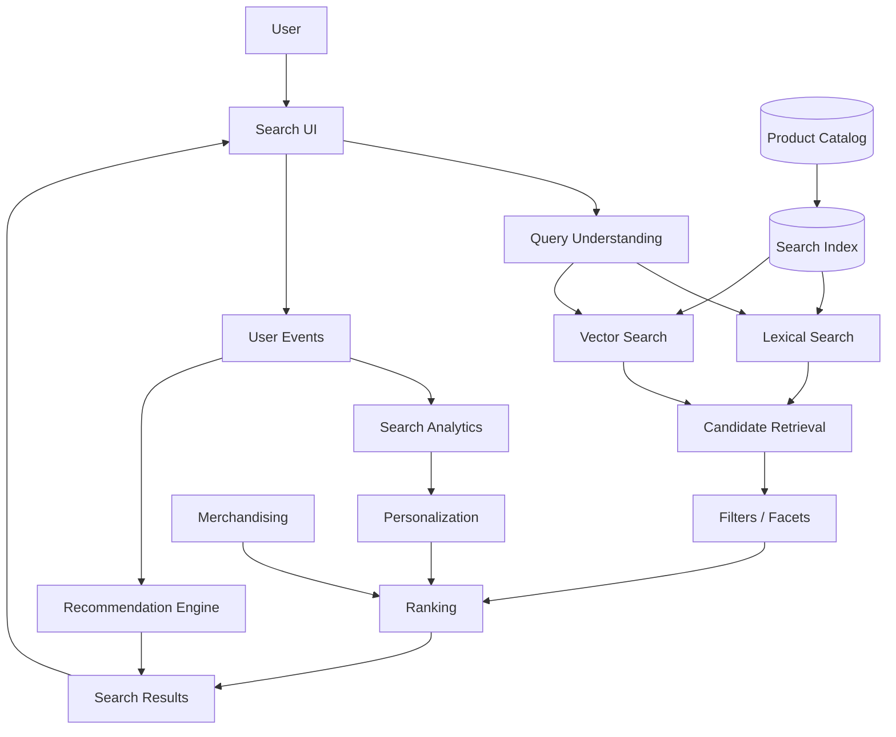
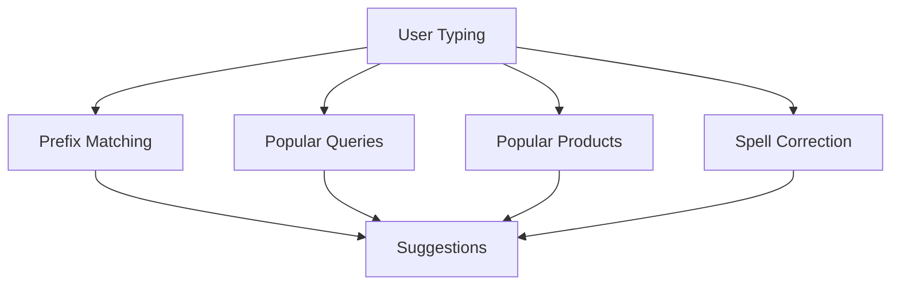
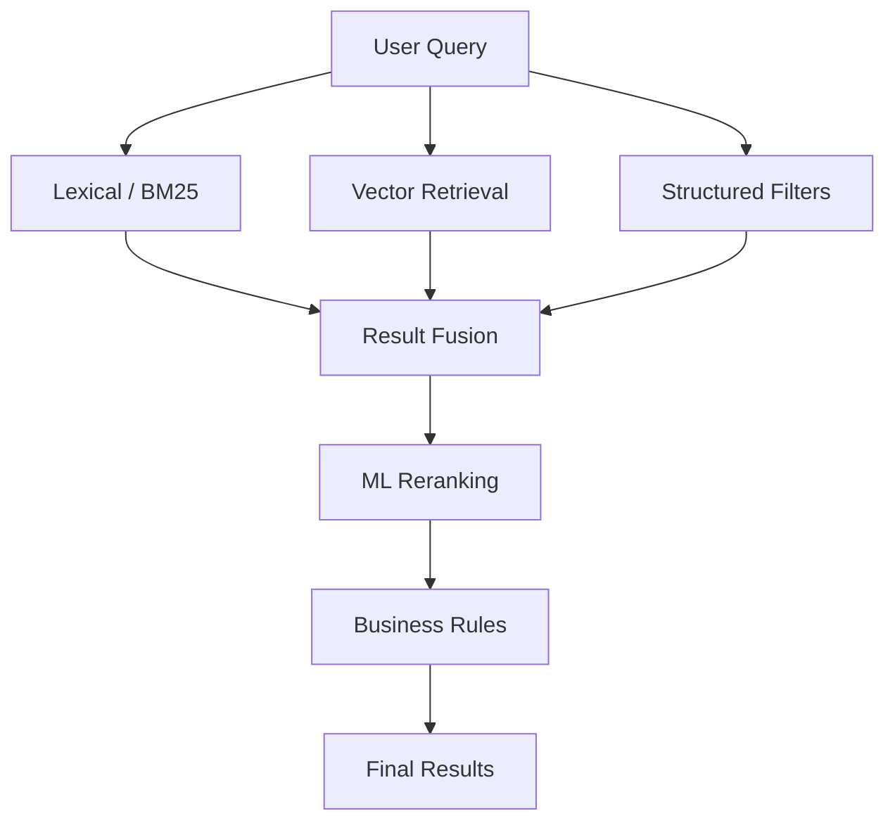
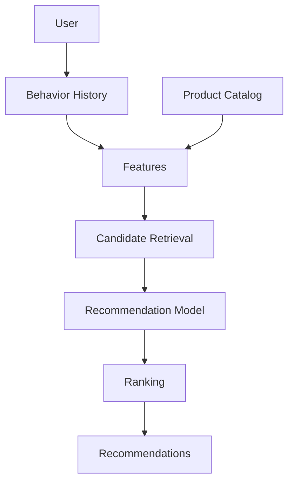
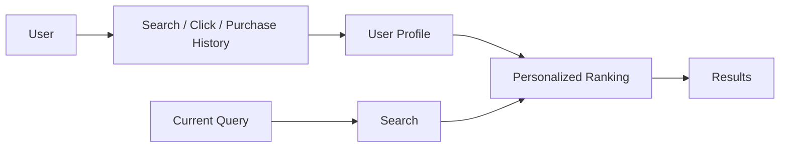
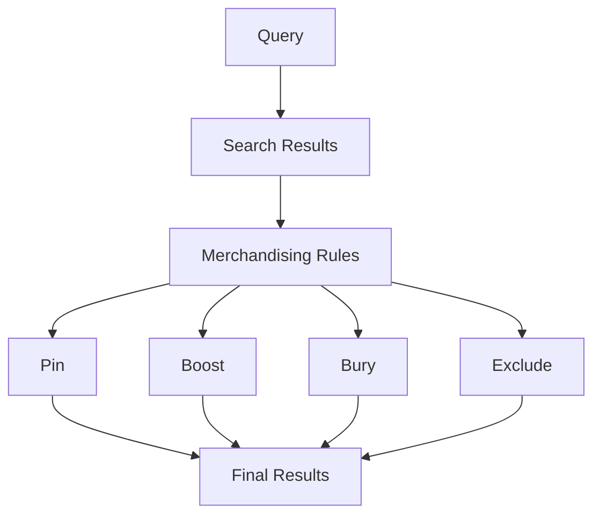
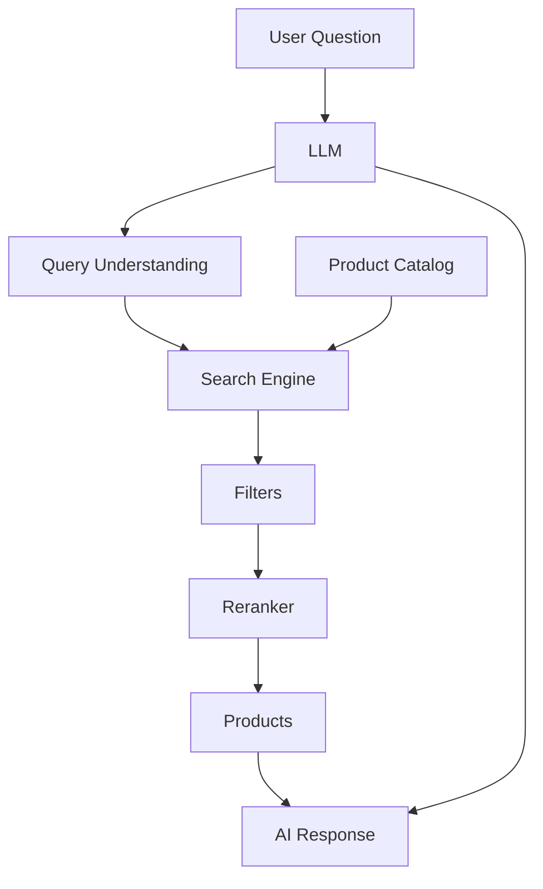

# Awesome-Search-n-Discovery-Platform

## Top Search & Discovery Platforms


**A comprehensive ecosystem of search, product discovery, site search, ecommerce search, recommendations, AI search, semantic retrieval and open-source search platforms**


*Open-source-first reference covering ecommerce search, enterprise search, product discovery, autocomplete, faceted navigation, relevance engineering, semantic search, vector retrieval, personalization, recommendations, merchandising and AI-powered discovery.*


**Last updated: September 2026**


Search & Discovery platforms help websites, ecommerce stores, marketplaces, SaaS applications and digital businesses help users find the right information, products or content quickly.


Typical capabilities include:


* full-text search

* autocomplete

* typo tolerance

* faceted navigation

* filtering

* sorting

* synonyms

* query understanding

* relevance ranking

* semantic search

* vector search

* hybrid search

* natural-language search

* product discovery

* recommendations

* personalization

* merchandising

* search analytics

* A/B testing

* behavioral ranking

* category discovery

* visual search

* conversational shopping


Examples include **Algolia, Constructor, Bloomreach Discovery, Coveo, Searchspring, Luigi's Box, Klevu, Elastic Search AI, Clerk.io and Prefixbox**.


Modern search architecture increasingly looks like:


```text

User Query

    ↓

Query Understanding

    ↓

Candidate Retrieval

    ↓

Lexical + Semantic Search

    ↓

Filtering

    ↓

Ranking

    ↓

Personalization

    ↓

Merchandising

    ↓

Recommendations

    ↓

Search Results

```


The open-source ecosystem is particularly strong at the **search-engine and retrieval layer**. Projects such as Elasticsearch, OpenSearch, Apache Solr, Vespa, Meilisearch and Typesense provide powerful foundations, while Qdrant, Weaviate, Milvus and pgvector add vector/semantic retrieval capabilities.


However:


> **An open-source search engine is not automatically a complete Algolia, Constructor or Bloomreach replacement.**


A production-grade product-discovery platform also needs:


```text

Search Engine

+

Product Catalog

+

Query Understanding

+

Ranking

+

Merchandising

+

Analytics

+

Personalization

+

Recommendations

+

Experimentation

+

Business Rules

```


This README therefore separates the **SaaS/Hosted Platforms** from the much larger **Open-Source ecosystem**.


---


## Open-source emphasis


Open-source projects are divided into:


1. **Direct search/discovery platforms**

2. **Open-source search engines**

3. **Ecommerce-specific search stacks**

4. **Vector databases**

5. **Recommendation engines**

6. **Semantic and hybrid search**

7. **Search UI frameworks**

8. **Query/ranking libraries**

9. **Analytics and experimentation**

10. **AI/RAG infrastructure**

11. **Commerce platforms with integrated search**

12. **Composable building blocks**


A useful distinction is:


```text

SEARCH ENGINE

      ↓

RETRIEVAL

      ↓

RANKING

      ↓

DISCOVERY PLATFORM

      ↓

PERSONALIZATION

      ↓

MERCHANDISING

      ↓

CONVERSION OPTIMIZATION

```


Projects such as **Meilisearch** and **Typesense** are particularly attractive for developers seeking simpler alternatives to Algolia. Typesense explicitly positions itself as an open-source alternative to Algolia and an easier-to-use alternative to Elasticsearch. ([Typesense](https://typesense.org/docs/overview/what-is-typesense.html))


For large-scale ecommerce search, **Elasticsearch, OpenSearch, Solr and Vespa** provide much deeper infrastructure, while **Qdrant, Weaviate, Milvus and pgvector** are particularly useful when semantic/vector retrieval becomes central.


The open-source ecommerce-search ecosystem also includes projects such as **Chorus**, which aims to provide an open stack for ecommerce search rather than merely an underlying search engine. ([Chorus](https://github.com/querqy/chorus))


> **Important licensing note:** "Open source" is not uniform across this ecosystem. Elasticsearch and some Elastic components have multiple licensing models; Meilisearch combines MIT-licensed Community Edition components with BUSL-1.1 Enterprise components; Typesense is GPLv3; OpenSearch is Apache 2.0. Always verify the exact version, edition and component license before commercial redistribution.


---


## Table of Contents


* [SaaS/Hosted Platforms](#saashosted-platforms)

* [Open-Source Search & Discovery Platforms](#open-source-search--discovery-platforms)

* [Open-Source Search Engines](#open-source-search-engines)

* [Open-Source Ecommerce Search](#open-source-ecommerce-search)

* [Open-Source Vector & Semantic Search](#open-source-vector--semantic-search)

* [Open-Source Recommendation Engines](#open-source-recommendation-engines)

* [Open-Source Search UI & Frontend Libraries](#open-source-search-ui--frontend-libraries)

* [Open-Source Relevance & Ranking](#open-source-relevance--ranking)

* [Open-Source Query Understanding](#open-source-query-understanding)

* [Open-Source Search Analytics](#open-source-search-analytics)

* [Open-Source Commerce Platforms](#open-source-commerce-platforms)

* [Open-Source AI Search & RAG](#open-source-ai-search--rag)

* [Additional Strong Open-Source Options](#additional-strong-open-source-options)

* [Commercial Platform → Open-Source Equivalents](#commercial-platform--open-source-equivalents)

* [Frameworks for Building Custom Search & Discovery Platforms](#frameworks-for-building-custom-search--discovery-platforms)

* [Reference Architecture](#reference-architecture)

* [Typical Search Workflow](#typical-search-workflow)

* [Autocomplete Workflow](#autocomplete-workflow)

* [Semantic Search Workflow](#semantic-search-workflow)

* [Hybrid Search Workflow](#hybrid-search-workflow)

* [Recommendation Workflow](#recommendation-workflow)

* [Personalization Workflow](#personalization-workflow)

* [Merchandising Workflow](#merchandising-workflow)

* [AI Shopping Assistant Workflow](#ai-shopping-assistant-workflow)

* [Capability Matrix](#capability-matrix)

* [Recommended Open-Source Stacks](#recommended-open-source-stacks)

* [What Is Still Difficult to Reproduce in Open Source?](#what-is-still-difficult-to-reproduce-in-open-source)

* [Why Open Source Is Interesting](#why-open-source-is-interesting)

* [How to Contribute](#how-to-contribute)

* [Disclaimer](#disclaimer)


---


# SaaS/Hosted Platforms


These are commercial, hosted or enterprise-oriented search, discovery, personalization and recommendation platforms.


| Platform                                                                 | Primary Model             | Main Strength                        |

| ------------------------------------------------------------------------ | ------------------------- | ------------------------------------ |

| [Algolia](https://www.algolia.com/)                                      | Search-as-a-Service       | Developer-first instant search       |

| [Constructor](https://constructor.com/)                                  | Ecommerce discovery       | Search + browse + recommendations    |

| [Bloomreach Discovery](https://www.bloomreach.com/en/products/discovery) | Ecommerce discovery       | AI search + personalization          |

| [Coveo](https://www.coveo.com/)                                          | Enterprise AI search      | AI relevance + enterprise search     |

| [Searchspring](https://searchspring.com/)                                | Ecommerce search          | Merchandising + product discovery    |

| [Luigi's Box](https://www.luigisbox.com/)                                | Ecommerce discovery       | Search + recommendations + analytics |

| [Klevu](https://www.klevu.com/)                                          | Ecommerce AI search       | AI search + merchandising            |

| [Elastic Search AI](https://www.elastic.co/enterprise-search)            | Search/AI                 | Search + vector + AI                 |

| [Clerk.io](https://www.clerk.io/)                                        | Ecommerce personalization | Search + recommendations             |

| [Prefixbox](https://www.prefixbox.com/)                                  | Ecommerce search          | Search + autocomplete                |

| [Search.io](https://www.search.io/)                                      | AI search                 | Search + recommendations             |

| [Yext](https://www.yext.com/)                                            | Enterprise search         | Knowledge + AI search                |

| [Constructor](https://constructor.com/)                                  | Product discovery         | Search + category pages              |

| [Nosto](https://www.nosto.com/)                                          | Commerce personalization  | Personalization + recommendations    |

| [Dynamic Yield](https://www.dynamicyield.com/)                           | Personalization           | Recommendations + experimentation    |

| [Algolia Recommend](https://www.algolia.com/products/recommend/)         | Recommendations           | AI-powered recommendations           |

| [Bloomreach](https://www.bloomreach.com/)                                | Commerce experience       | Discovery + engagement               |

| [Coveo](https://www.coveo.com/)                                          | Enterprise search         | Relevance + AI                       |

| [Searchanise](https://searchanise.com/)                                  | Ecommerce search          | Shopify/ecommerce search             |

| [Doofinder](https://www.doofinder.com/)                                  | Ecommerce search          | Search + merchandising               |

| [FactFinder](https://www.fact-finder.com/)                               | Ecommerce discovery       | Search + recommendations             |

| [Findify](https://findify.io/)                                           | Ecommerce search          | AI search + merchandising            |

| [Sajari](https://www.sajari.com/)                                        | Search                    | Site search + discovery              |

| [Unbxd](https://unbxd.com/)                                              | Ecommerce discovery       | Search + recommendations             |

| [SearchNode](https://searchnode.com/)                                    | Ecommerce search          | AI search + personalization          |

| [Syte](https://www.syte.ai/)                                             | Visual commerce           | Visual search + discovery            |


---


# Open-Source Search & Discovery Platforms


This is the most important section for anyone attempting to build an open-source alternative to Algolia, Constructor, Bloomreach Discovery or Coveo.


---


# 1. Meilisearch


[GitHub](https://github.com/meilisearch/meilisearch)


[Website](https://www.meilisearch.com/)


Meilisearch is one of the strongest open-source choices for teams looking for an **Algolia-like developer experience**.


It focuses on:


* instant search

* typo tolerance

* filtering

* faceting

* sorting

* synonyms

* prefix search

* ranking

* semantic/vector search

* hybrid search


Architecture:


```text

Product Catalog

      ↓

Meilisearch

      ↓

Search API

      ↓

Frontend

```


It is particularly attractive for:


* ecommerce

* documentation

* SaaS applications

* marketplaces

* internal search


Meilisearch documents direct comparisons with Algolia, Typesense and Elasticsearch and provides search features such as faceting, filtering, typo tolerance and hybrid/vector search. ([Meilisearch](https://www.meilisearch.com/docs/resources/comparisons/alternatives))


> **Licensing:** Meilisearch's Community Edition includes MIT-licensed components, while some Enterprise functionality uses BUSL-1.1. Check the current edition and component before deployment or redistribution.


---


# 2. Typesense


[GitHub](https://github.com/typesense/typesense)


[Website](https://typesense.org/)


Typesense is one of the closest open-source alternatives to Algolia.


It emphasizes:


* instant search

* typo tolerance

* faceting

* filtering

* sorting

* autocomplete

* geo-search

* semantic search

* vector search


Typesense explicitly describes itself as:


```text

Open-source alternative to Algolia

```


and as a simpler, batteries-included alternative to Elasticsearch. ([Typesense](https://typesense.org/docs/overview/what-is-typesense.html))


A typical architecture:


```text

PostgreSQL

     ↓

Typesense

     ↓

Search API

     ↓

InstantSearch UI

```


It is particularly attractive for:


* ecommerce

* SaaS search

* marketplaces

* catalogs

* documentation

* location-aware search


---


# 3. Vespa


[GitHub](https://github.com/vespa-engine/vespa)


[Website](https://vespa.ai/)


Vespa is one of the most powerful open-source platforms for large-scale:


* search

* recommendation

* vector retrieval

* machine learning inference

* ranking

* personalization


Vespa is particularly interesting for systems that need:


```text

Retrieval

+

Ranking

+

ML

+

Vector Search

+

Real-Time Data

```


Architecture:


```text

Query

 ↓

Candidate Retrieval

 ↓

Feature Extraction

 ↓

ML Ranking

 ↓

Personalization

 ↓

Results

```


It is closer to a **search + recommendation engine** than a simple text-search server.


---


# 4. OpenSearch


[GitHub](https://github.com/opensearch-project/OpenSearch)


OpenSearch is an Apache-2.0 search and analytics platform.


It provides:


* full-text search

* filtering

* aggregations

* faceting

* vector search

* neural search

* hybrid search

* ranking

* dashboards


It is particularly useful when search needs to coexist with:


```text

Analytics

+

Observability

+

Vector Retrieval

+

Security

```


---


# 5. Apache Solr


[GitHub](https://github.com/apache/solr)


Apache Solr is a mature open-source search platform built on Apache Lucene.


Capabilities include:


* full-text search

* faceting

* filtering

* distributed search

* highlighting

* autocomplete

* geospatial search

* learning-to-rank

* vector search

* streaming expressions


Solr remains one of the most capable open-source foundations for enterprise and ecommerce search.


---


# 6. Elasticsearch


[GitHub](https://github.com/elastic/elasticsearch)


Elasticsearch is one of the world's most widely deployed search engines.


It provides:


* full-text search

* faceting

* filtering

* aggregations

* vector search

* semantic search

* hybrid search

* ranking

* machine learning

* search analytics


It is one of the strongest technical foundations for building a Bloomreach/Coveo-style platform.


> **Licensing note:** Elasticsearch's licensing is more complex than a simple "Apache-licensed open-source" label. Current Elasticsearch distributions and features use multiple licensing models. Verify the exact version and component before using it as an open-source replacement.


---


# 7. Sonic


[GitHub](https://github.com/valeriansaliou/sonic)


Sonic is a lightweight search backend written in Rust.


Useful for:


* autocomplete

* lightweight search

* small catalogs

* embedded search services

* low-resource deployments


It is much simpler than Elasticsearch or Solr and is therefore better suited to narrower use cases.


---


# 8. Tantivy


[GitHub](https://github.com/quickwit-oss/tantivy)


Tantivy is a Rust search library inspired by Lucene.


It is useful when you want:


```text

Custom Search Engine

```


rather than a complete search server.


Possible architecture:


```text

Application

    ↓

Tantivy

    ↓

Custom Ranking

    ↓

Results

```


---


# 9. Quickwit


[GitHub](https://github.com/quickwit-oss/quickwit)


Quickwit is a distributed search engine optimized for large-scale indexing and search.


It is particularly useful for:


* logs

* time-series data

* observability

* large document collections


It can also serve as a building block for specialized search systems.


---


# Open-Source Search Engines


The following engines are important foundations even when they are not complete product-discovery platforms.


| Project                                                        | Main Strength             | Best Use              |

| -------------------------------------------------------------- | ------------------------- | --------------------- |

| [Elasticsearch](https://github.com/elastic/elasticsearch)      | Distributed search        | Enterprise/ecommerce  |

| [OpenSearch](https://github.com/opensearch-project/OpenSearch) | Open search + analytics   | Enterprise/search     |

| [Apache Solr](https://github.com/apache/solr)                  | Mature Lucene platform    | Enterprise/ecommerce  |

| [Vespa](https://github.com/vespa-engine/vespa)                 | Search + ranking + ML     | Large-scale discovery |

| [Meilisearch](https://github.com/meilisearch/meilisearch)      | Developer-friendly search | Ecommerce/SaaS        |

| [Typesense](https://github.com/typesense/typesense)            | Instant search            | Ecommerce/catalog     |

| [Sonic](https://github.com/valeriansaliou/sonic)               | Lightweight search        | Small apps            |

| [Tantivy](https://github.com/quickwit-oss/tantivy)             | Search library            | Custom engines        |

| [Quickwit](https://github.com/quickwit-oss/quickwit)           | Distributed search        | Large datasets        |

| [ZincSearch](https://github.com/zincsearch/zincsearch)         | Lightweight search        | Smaller deployments   |

| [Lunr.js](https://github.com/olivernn/lunr.js)                 | Client-side search        | Static sites          |

| [MiniSearch](https://github.com/lucaong/minisearch)            | Browser search            | Client applications   |

| [FlexSearch](https://github.com/nextapps-de/flexsearch)        | Fast client-side search   | Web apps              |


---


# Open-Source Ecommerce Search


## Chorus


[GitHub](https://github.com/querqy/chorus)


Chorus is particularly interesting because it explicitly targets:


> **An open-source stack for ecommerce search**


rather than merely providing an indexing engine.


It addresses:


* ecommerce search

* relevance engineering

* tooling integration

* analytics

* experimentation

* sample data

* search evaluation


Architecture:


```text

Product Catalog

      ↓

Search Engine

      ↓

Relevance Layer

      ↓

Analytics

      ↓

Experimentation

      ↓

Search Optimization

```


Chorus is Apache-2.0 licensed. ([GitHub](https://github.com/querqy/chorus))


---


# Searchkit


[GitHub](https://github.com/searchkit/searchkit)


Searchkit is a toolkit for building search experiences on top of Elasticsearch/OpenSearch-style backends.


It provides:


* search UI

* filters

* facets

* sorting

* query handling

* React integration


Architecture:


```text

React

 ↓

Searchkit

 ↓

Elasticsearch / OpenSearch

 ↓

Products

```


It is especially useful for building an open-source equivalent of the **frontend/search-experience layer** of Algolia.


---


# ReactiveSearch


[GitHub](https://github.com/appbaseio/reactivesearch)


ReactiveSearch provides UI components and abstractions for building search applications.


Useful for:


* filters

* faceting

* search boxes

* result lists

* maps

* dashboards

* ecommerce interfaces


---


# Magento / Adobe Commerce Search Ecosystem


Open-source ecommerce platforms can combine with:


* Elasticsearch

* OpenSearch

* Solr

* custom search APIs


This provides a useful foundation for building:


```text

Commerce

+

Catalog

+

Inventory

+

Search

+

Faceting

+

Merchandising

```


---


# Open-Source Vector & Semantic Search


Modern product discovery increasingly combines keyword and semantic retrieval.


---


# Qdrant


[GitHub](https://github.com/qdrant/qdrant)


Qdrant is a vector database/search engine.


Useful for:


* semantic search

* product similarity

* recommendations

* "similar products"

* visual embeddings

* personalized retrieval


Architecture:


```text

Product

 ↓

Embedding

 ↓

Qdrant

 ↓

Nearest Neighbors

 ↓

Candidate Products

```


---


# Weaviate


[GitHub](https://github.com/weaviate/weaviate)


Weaviate is an open-source vector database with:


* vector search

* hybrid search

* metadata filtering

* semantic retrieval

* multimodal search


Useful for AI-powered product discovery.


---


# Milvus


[GitHub](https://github.com/milvus-io/milvus)


Distributed vector database designed for large-scale similarity search.


Useful for:


* product embeddings

* semantic search

* recommendation

* visual similarity

* AI retrieval


---


# pgvector


[GitHub](https://github.com/pgvector/pgvector)


Adds vector similarity search to PostgreSQL.


This is particularly attractive for smaller ecommerce systems:


```text

PostgreSQL

 ├── Product Data

 ├── Inventory

 ├── Customer Data

 └── Embeddings

```


rather than deploying a separate vector database.


---


# LanceDB


[GitHub](https://github.com/lancedb/lancedb)


Developer-friendly vector database useful for:


* semantic search

* multimodal retrieval

* recommendation

* AI applications


---


# Chroma


[GitHub](https://github.com/chroma-core/chroma)


Open-source AI-native retrieval database useful for:


* semantic search

* RAG

* recommendation prototypes

* product embeddings


---


# Open-Source Recommendation Engines


Search and recommendation increasingly converge.


---


# Apache Mahout


[GitHub](https://github.com/apache/mahout)


Machine-learning framework with recommendation-related capabilities.


---


# LensKit


[GitHub](https://github.com/lenskit/lkpy)


Toolkit for building and evaluating recommender systems.


Useful for:


* collaborative filtering

* ranking

* experimentation

* recommendation research


---


# LightFM


[GitHub](https://github.com/lyst/lightfm)


Python recommendation library supporting hybrid recommendation.


Useful for:


```text

Users

+

Products

+

Interactions

+

Product Metadata

```


---


# Surprise


[GitHub](https://github.com/NicolasHug/Surprise)


Python recommender-system library useful for collaborative filtering experiments.


---


# RecBole


[GitHub](https://github.com/RUCAIBox/RecBole)


Comprehensive recommendation library with many recommendation algorithms.


---


# Merlin


[GitHub](https://github.com/NVIDIA-Merlin/Merlin)


NVIDIA's open-source ecosystem for recommender systems.


Useful for:


* feature engineering

* retrieval

* ranking

* deep-learning recommendations

* large-scale recommendation pipelines


---


# Vespa Recommendation


Vespa deserves special attention because it can combine:


```text

Search

+

Retrieval

+

Recommendation

+

Ranking

+

ML

```


inside one platform.


This makes Vespa particularly interesting as an open-source alternative to architectures that otherwise require separate:


```text

Search Engine

+

Vector DB

+

Recommendation Engine

+

Ranking Service

```


---


# Open-Source Search UI & Frontend Libraries


## InstantSearch.js


[GitHub](https://github.com/algolia/instantsearch)


Algolia's open-source UI library.


It provides:


* search boxes

* filters

* facets

* refinement

* pagination

* sorting

* search state management


It is **not itself a search engine**.


It can nevertheless serve as a useful frontend model when replacing Algolia's backend.


---


## Searchkit


[GitHub](https://github.com/searchkit/searchkit)


Useful for React-based search experiences.


---


## ReactiveSearch


[GitHub](https://github.com/appbaseio/reactivesearch)


Provides reusable search components.


---


## Meilisearch UI


[GitHub](https://github.com/meilisearch)


Meilisearch provides SDKs and UI integrations suitable for building instant-search experiences.


---


## Typesense InstantSearch Adapter


[GitHub](https://github.com/typesense/typesense-instantsearch-adapter)


Allows Algolia-style InstantSearch interfaces to work with Typesense.


---


# Open-Source Relevance & Ranking


Search quality is not determined solely by the search engine.


It depends heavily on ranking.


---


# Apache Solr Learning-to-Rank


[GitHub](https://github.com/apache/solr)


Solr supports learning-to-rank capabilities.


Architecture:


```text

Query

 ↓

Candidate Retrieval

 ↓

Feature Extraction

 ↓

ML Ranker

 ↓

Final Results

```


---


# Elasticsearch Learning to Rank


[GitHub](https://github.com/o19s/elasticsearch-learning-to-rank)


Provides learning-to-rank tooling for Elasticsearch.


---


# XGBoost


[GitHub](https://github.com/dmlc/xgboost)


Useful for:


* ranking

* classification

* relevance models

* conversion prediction


---


# LightGBM


[GitHub](https://github.com/microsoft/LightGBM)


Useful for:


* ranking

* learning-to-rank

* relevance optimization


---


# CatBoost


[GitHub](https://github.com/catboost/catboost)


Useful for ranking and prediction when categorical features are important.


---


# Open-Source Query Understanding


Modern discovery begins before retrieval.


The query:


```text

"black nike shoes for running under 100"

```


can be transformed into:


```text

Brand = Nike

Category = Running Shoes

Color = Black

Price < 100

```


---


# spaCy


[GitHub](https://github.com/explosion/spaCy)


Useful for:


* entity extraction

* intent classification

* NLP

* query parsing


---


# Hugging Face Transformers


[GitHub](https://github.com/huggingface/transformers)


Useful for:


* semantic query understanding

* embeddings

* classification

* reranking

* query rewriting


---


# Sentence Transformers


[GitHub](https://github.com/UKPLab/sentence-transformers)


Useful for:


* semantic similarity

* embeddings

* product-query matching

* reranking


---


# fastText


[GitHub](https://github.com/facebookresearch/fastText)


Useful for:


* text classification

* language identification

* lightweight NLP


---


# Open-Source Search Analytics


A search platform should record:


```text

Query

+

Results

+

Clicks

+

Add-to-Cart

+

Purchase

+

No-Result

+

Abandonment

```


---


# PostHog


[GitHub](https://github.com/PostHog/posthog)


Useful for:


* product analytics

* feature flags

* experimentation

* user behavior


---


# Matomo


[GitHub](https://github.com/matomo-org/matomo)


Open-source web analytics platform.


---


# Grafana


[GitHub](https://github.com/grafana/grafana)


Useful for search dashboards.


---


# Apache Superset


[GitHub](https://github.com/apache/superset)


Useful for:


* search analytics

* ecommerce dashboards

* conversion analysis


---


# Metabase


[GitHub](https://github.com/metabase/metabase)


Useful for business-facing search analytics.


---


# Open-Source Commerce Platforms


Search is usually strongest when integrated directly with the product catalog.


## Saleor


[GitHub](https://github.com/saleor/saleor)


Headless ecommerce platform.


---


## Medusa


[GitHub](https://github.com/medusajs/medusa)


Composable commerce platform.


---


## WooCommerce


[GitHub](https://github.com/woocommerce/woocommerce)


Open-source ecommerce ecosystem.


---


## Magento Open Source


[GitHub](https://github.com/magento/magento2)


Enterprise-grade open-source ecommerce foundation.


---


## PrestaShop


[GitHub](https://github.com/PrestaShop/PrestaShop)


Open-source ecommerce platform.


---


## Sylius


[GitHub](https://github.com/Sylius/Sylius)


Headless/composable ecommerce framework.


---


## Shopware


[GitHub](https://github.com/shopware/shopware)


Open-source commerce platform with modern APIs.


---


# Open-Source AI Search & RAG


Modern product discovery is increasingly merging with conversational AI.


---


# LlamaIndex


[GitHub](https://github.com/run-llama/llama_index)


Useful for:


* catalog retrieval

* RAG

* product assistants

* conversational discovery


---


# LangChain


[GitHub](https://github.com/langchain-ai/langchain)


Useful for building:


* search agents

* product assistants

* query rewriting

* retrieval pipelines


---


# Haystack


[GitHub](https://github.com/deepset-ai/haystack)


Useful for:


* semantic retrieval

* RAG

* reranking

* question answering


---


# Ollama


[GitHub](https://github.com/ollama/ollama)


Allows local LLM deployment.


Potential use:


```text

User Query

 ↓

Local LLM

 ↓

Query Understanding

 ↓

Search Engine

 ↓

Results

```


---


# vLLM


[GitHub](https://github.com/vllm-project/vllm)


High-performance open-source LLM inference engine.


Useful for large-scale AI search assistants.


---


# Additional Strong Open-Source Options


## Search Engines


* [Elasticsearch](https://github.com/elastic/elasticsearch)

* [OpenSearch](https://github.com/opensearch-project/OpenSearch)

* [Apache Solr](https://github.com/apache/solr)

* [Vespa](https://github.com/vespa-engine/vespa)

* [Meilisearch](https://github.com/meilisearch/meilisearch)

* [Typesense](https://github.com/typesense/typesense)

* [Sonic](https://github.com/valeriansaliou/sonic)

* [Tantivy](https://github.com/quickwit-oss/tantivy)

* [Quickwit](https://github.com/quickwit-oss/quickwit)

* [ZincSearch](https://github.com/zincsearch/zincsearch)


## Ecommerce Search


* [Chorus](https://github.com/querqy/chorus)

* [Searchkit](https://github.com/searchkit/searchkit)

* [ReactiveSearch](https://github.com/appbaseio/reactivesearch)


## Vector Search


* [Qdrant](https://github.com/qdrant/qdrant)

* [Weaviate](https://github.com/weaviate/weaviate)

* [Milvus](https://github.com/milvus-io/milvus)

* [pgvector](https://github.com/pgvector/pgvector)

* [LanceDB](https://github.com/lancedb/lancedb)

* [Chroma](https://github.com/chroma-core/chroma)


## Recommendations


* [LensKit](https://github.com/lenskit/lkpy)

* [LightFM](https://github.com/lyst/lightfm)

* [Surprise](https://github.com/NicolasHug/Surprise)

* [RecBole](https://github.com/RUCAIBox/RecBole)

* [NVIDIA Merlin](https://github.com/NVIDIA-Merlin/Merlin)

* [Vespa](https://github.com/vespa-engine/vespa)


## NLP / Query Understanding


* [spaCy](https://github.com/explosion/spaCy)

* [Transformers](https://github.com/huggingface/transformers)

* [Sentence Transformers](https://github.com/UKPLab/sentence-transformers)

* [fastText](https://github.com/facebookresearch/fastText)


## Analytics


* [PostHog](https://github.com/PostHog/posthog)

* [Matomo](https://github.com/matomo-org/matomo)

* [Grafana](https://github.com/grafana/grafana)

* [Metabase](https://github.com/metabase/metabase)

* [Apache Superset](https://github.com/apache/superset)


## AI


* [LlamaIndex](https://github.com/run-llama/llama_index)

* [LangChain](https://github.com/langchain-ai/langchain)

* [Haystack](https://github.com/deepset-ai/haystack)

* [Ollama](https://github.com/ollama/ollama)

* [vLLM](https://github.com/vllm-project/vllm)


---


# Commercial Platform → Open-Source Equivalents


| Commercial / Hosted Platform     | Closest Open-Source Options                                | Notes                                           |

| -------------------------------- | ---------------------------------------------------------- | ----------------------------------------------- |

| **Algolia**                      | Meilisearch / Typesense                                    | Closest developer-experience alternatives       |

| **Constructor**                  | Vespa + Chorus + Searchkit                                 | Search + ranking + ecommerce discovery          |

| **Bloomreach Discovery**         | Vespa + OpenSearch + Qdrant + recommendation stack         | Requires significant composition                |

| **Coveo**                        | Vespa + OpenSearch + Haystack                              | Enterprise AI search architecture               |

| **Searchspring**                 | Elasticsearch/OpenSearch + Searchkit + merchandising layer | Strong ecommerce search foundation              |

| **Luigi's Box**                  | Meilisearch/Typesense + analytics + recommendation engine  | Requires analytics/personalization              |

| **Klevu**                        | Typesense/Meilisearch + vector search + ranking            | Good composable architecture                    |

| **Elastic Search AI**            | Elasticsearch / OpenSearch + vector DB                     | Closest technology-family alternatives          |

| **Clerk.io**                     | Vespa + recommendation engine + analytics                  | Search + recommendations                        |

| **Prefixbox**                    | Typesense / Meilisearch + autocomplete                     | Strong autocomplete foundation                  |

| **Search.io**                    | Vespa + OpenSearch + vector retrieval                      | AI search stack                                 |

| **Yext**                         | OpenSearch + knowledge graph + RAG                         | Enterprise knowledge-search architecture        |

| **Nosto**                        | Vespa + recommendation stack + PostHog                     | Personalization requires additional engineering |

| **Dynamic Yield**                | Vespa + RecBole + PostHog                                  | Recommendation + experimentation                |

| **FactFinder**                   | Solr / Elasticsearch + merchandising layer                 | Mature search architecture                      |

| **Findify**                      | Typesense + Searchkit + recommendation stack               | Ecommerce-oriented                              |

| **Doofinder**                    | Meilisearch + Typesense + analytics                        | Lightweight ecommerce alternative               |

| **Generic ecommerce search**     | Typesense + Searchkit                                      | Strong starting point                           |

| **Generic AI product discovery** | Vespa + Qdrant + LLM                                       | Powerful composable architecture                |


---


# Frameworks for Building Custom Search & Discovery Platforms


A production search platform consists of several layers.


## 1. Product Catalog


```text

Product

 ├── Name

 ├── Description

 ├── Brand

 ├── Category

 ├── Price

 ├── Attributes

 ├── Availability

 ├── Images

 ├── Rating

 └── Inventory

```


---


# 2. Indexing


```text

Product Database

      ↓

Change Detection

      ↓

Transformation

      ↓

Search Index

```


Possible engines:


* Elasticsearch

* OpenSearch

* Solr

* Vespa

* Meilisearch

* Typesense


---


# 3. Query Understanding


Example:


```text

"red running shoes under 100"

```


becomes:


```text

Color = Red

Category = Running Shoes

Price < 100

Intent = Purchase

```


---


# 4. Candidate Retrieval


A query can use multiple retrieval strategies:


```text

Lexical

   +

Semantic

   +

Vector

   +

Popularity

   +

Personalization

```


---


# 5. Hybrid Search


Modern discovery often uses:


```text

BM25

+

Dense Vector Search

+

Business Rules

```


Example:


```text

Query

 ↓

BM25

 ↓

Vector Search

 ↓

Merge

 ↓

Rerank

```


---


# 6. Ranking


Possible ranking signals:


```text

Text Relevance

+

Popularity

+

Conversion Rate

+

Margin

+

Availability

+

Price

+

Customer Preference

+

Business Rules

```


---


# 7. Personalization


A search result can be personalized according to:


```text

User

+

Location

+

Previous Searches

+

Previous Purchases

+

Clicks

+

Preferences

```


---


# 8. Merchandising


Merchandising allows businesses to override purely algorithmic ranking.


Examples:


```text

Query: "laptop"


Business Rule:

Promote Product A


Business Rule:

Demote Product B


Business Rule:

Pin Product C


Business Rule:

Exclude Product D

```


---


# 9. Recommendations


Recommendation modules include:


```text

Similar Products

Frequently Bought Together

Recently Viewed

Trending Products

Personalized Products

Alternative Products

Complementary Products

```


---


# 10. Search Analytics


Track:


```text

Queries

+

Clicks

+

Add-to-Cart

+

Purchase

+

Zero Results

+

Refinement

+

Abandonment

```


---


# 11. Search Quality Evaluation


A mature search platform needs offline evaluation.


Useful metrics:


```text

Precision

Recall

MRR

NDCG

CTR

Conversion Rate

Add-to-Cart Rate

Revenue per Search

Zero-Result Rate

```


---


# Reference Architecture





---


# Typical Search Workflow


---


# Autocomplete Workflow





---


# Semantic Search Workflow


---


# Hybrid Search Workflow





---


# Recommendation Workflow





---


# Personalization Workflow





---


# Merchandising Workflow





---


# AI Shopping Assistant Workflow





---


# Product Discovery Data Model


A useful product-search schema contains:


```text

Product

 ├── ID

 ├── Name

 ├── Description

 ├── Brand

 ├── Category

 ├── Price

 ├── Currency

 ├── Availability

 ├── Inventory

 ├── Attributes

 ├── Images

 ├── Rating

 ├── Reviews

 ├── Popularity

 ├── Conversion Rate

 └── Embedding

```


---


# Query Model


```json

{

  "query": "black running shoes under 100",

  "filters": {

    "brand": [],

    "color": ["black"],

    "category": ["running shoes"],

    "price": {

      "max": 100

    }

  },

  "sort": "relevance",

  "page": 1,

  "user_id": "user-123"

}

```


---


# Search Ranking Model


A useful conceptual ranking function is:


```text

Final Score =

Text Relevance

+

Semantic Similarity

+

Popularity

+

Conversion Probability

+

Personalization

+

Availability

+

Business Rules

```


A more advanced model can be:


```text

Score =

w1 * BM25

+

w2 * VectorSimilarity

+

w3 * CTR

+

w4 * ConversionRate

+

w5 * UserAffinity

+

w6 * Inventory

+

w7 * BusinessPriority

```


---


# Search Quality Metrics


## Retrieval


```text

Precision

Recall

MRR

NDCG

```


## User Behavior


```text

CTR

Add-to-Cart Rate

Conversion Rate

```


## Search Quality


```text

Zero-Result Rate

Query Reformulation Rate

Search Abandonment

```


## Business


```text

Revenue per Search

Average Order Value

Gross Margin

Conversion per Search

```


---


# Zero-Result Handling


A mature search platform should not simply return:


```text

No Results

```


Instead:


```text

No Results

     ↓

Spell Correction

     ↓

Synonyms

     ↓

Semantic Search

     ↓

Broader Category

     ↓

Recommended Products

```


Example:


```text

"nik running shooes"

       ↓

"nike running shoes"

       ↓

Results

```


---


# Synonym Management


Example:


```text

"TV"

"Television"

"Smart TV"

```


can map to:


```text

television

```


Likewise:


```text

"sneakers"

"trainers"

"running shoes"

```


may require business-specific synonym rules.


---


# Faceted Search


A product-discovery interface can expose:


```text

Brand

Price

Color

Size

Rating

Availability

Category

Material

Style

Technology

```


Architecture:


```text

Query

 ↓

Search

 ↓

Facet Aggregation

 ↓

Filter

 ↓

Search Again

```


---


# Search Personalization


Example:


```text

Two users

+

Same Query

+

Different Search History

=

Different Ranking

```


User A:


```text

Premium products

```


User B:


```text

Budget products

```


A personalization engine can alter ranking while keeping the same underlying catalog.


---


# AI Query Understanding


Natural-language queries can be transformed into structured search:


```text

"I need a lightweight waterproof jacket for hiking in winter"

```


becomes:


```text

Category = Jacket

Use = Hiking

Season = Winter

Feature = Waterproof

Feature = Lightweight

```


This is one of the most important areas where LLMs and semantic models can complement traditional search.


---


# Visual Search


A visual-discovery architecture:


```text

Product Image

     ↓

Vision Encoder

     ↓

Embedding

     ↓

Vector Database

     ↓

Similar Products

```


Potential open-source components:


* CLIP

* OpenCLIP

* Qdrant

* Milvus

* Weaviate

* pgvector


---


# Multimodal Search


Modern discovery can combine:


```text

Text

+

Image

+

Voice

+

Structured Filters

+

User Context

```


Example:


```text

Upload Image

+

"Something similar but cheaper"

```


Workflow:


```text

Image

 ↓

Vision Embedding

 ↓

Similar Products

 ↓

Price Filter

 ↓

Ranking

 ↓

Results

```


---


# Open-Source Search Stack: Minimal


```text

Meilisearch

+

React

+

PostgreSQL

```


Best for:


* small ecommerce stores

* SaaS applications

* documentation

* MVPs

* simple catalogs


---


# Open-Source Search Stack: Algolia Alternative


```text

Typesense

+

InstantSearch Adapter

+

React

+

PostgreSQL

```


Best for:


* instant search

* autocomplete

* faceting

* ecommerce

* developer-friendly deployments


---


# Open-Source Enterprise Search Stack


```text

OpenSearch

+

OpenSearch Dashboards

+

PostgreSQL

+

Kafka

```


Best for:


* large catalogs

* enterprise search

* analytics

* distributed deployments


---


# Open-Source Ecommerce Discovery Stack


```text

Vespa

+

PostgreSQL

+

React

+

PostHog

```


Best for:


* advanced ranking

* personalization

* recommendations

* machine learning


---


# Open-Source AI Search Stack


```text

OpenSearch

+

Qdrant

+

Sentence Transformers

+

Reranker

+

Ollama / vLLM

+

PostgreSQL

```


Architecture:


```text

Query

 ↓

LLM / NLP

 ↓

BM25 + Vector

 ↓

Fusion

 ↓

Reranking

 ↓

Personalization

 ↓

Results

```


---


# Open-Source Full Product Discovery Stack


```text

                           PRODUCT CATALOG

                                  │

                                  ↓

                             PostgreSQL

                                  │

                  ┌───────────────┼───────────────┐

                  ↓               ↓               ↓

             Elasticsearch    Qdrant           Vespa

                  │               │               │

                  └───────────────┼───────────────┘

                                  ↓

                           Candidate Retrieval

                                  ↓

                           Query Understanding

                                  ↓

                              Reranking

                                  ↓

                           Personalization

                                  ↓

                            Merchandising

                                  ↓

                              Results

                                  ↓

                            PostHog/Grafana

                                  ↓

                          Learning / Feedback

```


---


# Capability Matrix


| Capability       |     Algolia | Constructor | Bloomreach |       Coveo |  Klevu |     Searchspring |     Meilisearch |     Typesense |         Vespa |     OpenSearch |

| ---------------- | ----------: | ----------: | ---------: | ----------: | -----: | ---------------: | --------------: | ------------: | ------------: | -------------: |

| Full-text search |           ✅ |           ✅ |          ✅ |           ✅ |      ✅ |                ✅ |               ✅ |             ✅ |             ✅ |              ✅ |

| Autocomplete     |           ✅ |           ✅ |          ✅ |           ✅ |      ✅ |                ✅ |               ✅ |             ✅ |             ✅ |              ✅ |

| Typo tolerance   |           ✅ |           ✅ |          ✅ |           ✅ |      ✅ |                ✅ |               ✅ |             ✅ |             ✅ |              ✅ |

| Faceting         |           ✅ |           ✅ |          ✅ |           ✅ |      ✅ |                ✅ |               ✅ |             ✅ |             ✅ |              ✅ |

| Semantic search  |           ✅ |           ✅ |          ✅ |           ✅ |      ✅ |       Increasing |               ✅ |             ✅ |             ✅ |              ✅ |

| Vector search    |           ✅ |           ✅ |          ✅ |           ✅ |      ✅ | Via integrations |               ✅ |             ✅ |             ✅ |              ✅ |

| Hybrid search    |           ✅ |           ✅ |          ✅ |           ✅ |      ✅ | Via integrations |               ✅ |             ✅ |             ✅ |              ✅ |

| Recommendations  | Via product |           ✅ |          ✅ | Via product |      ✅ |                ✅ |       Via stack |     Via stack |             ✅ |      Via stack |

| Personalization  |           ✅ |      Strong |     Strong |      Strong |      ✅ |                ✅ |          Custom |        Custom |             ✅ |         Custom |

| Merchandising    |           ✅ |      Strong |     Strong |      Strong | Strong |           Strong |          Custom |        Custom |        Custom |         Custom |

| Search analytics |           ✅ |           ✅ |          ✅ |           ✅ |      ✅ |                ✅ |   Via analytics | Via analytics | Via analytics | Via dashboards |

| A/B testing      |           ✅ |           ✅ |          ✅ |           ✅ |      ✅ |                ✅ |          Custom |        Custom |        Custom |         Custom |

| ML ranking       |           ✅ |           ✅ |          ✅ |           ✅ |      ✅ |                ✅ |          Custom |        Custom |             ✅ |         Custom |

| Self-hosted      |           ❌ |           ❌ |          ❌ |           ❌ |      ❌ |                ❌ |               ✅ |             ✅ |             ✅ |              ✅ |

| Open source      |           ❌ |           ❌ |          ❌ |           ❌ |      ❌ |                ❌ | Mixed licensing |             ✅ |             ✅ |              ✅ |


---


# Recommended Open-Source Stacks


## 1. Best Overall Algolia Alternative


```text

Typesense

+

Typesense InstantSearch Adapter

+

React

+

PostgreSQL

```


Why:


```text

Typesense

 ↓

Fast Search

 ↓

Typo Tolerance

 ↓

Faceting

 ↓

Autocomplete

 ↓

Vector Search

```


Typesense explicitly positions itself as an open-source alternative to Algolia. ([Typesense](https://typesense.org/docs/overview/what-is-typesense.html))


---


# 2. Best Simple Search Stack


```text

Meilisearch

+

React

+

PostgreSQL

```


Best for:


* startups

* SaaS

* small/medium catalogs

* documentation

* fast implementation


---


# 3. Best Enterprise Open-Source Search


```text

OpenSearch

+

PostgreSQL

+

Kafka

+

OpenSearch Dashboards

```


Best for:


* large organizations

* distributed search

* analytics

* enterprise applications


---


# 4. Best Advanced Ecommerce Discovery


```text

Vespa

+

PostgreSQL

+

React

+

PostHog

```


Best for:


* advanced ranking

* recommendation

* personalization

* ML-driven discovery


---


# 5. Best AI Search Stack


```text

OpenSearch

+

Qdrant

+

Sentence Transformers

+

Cross-Encoder

+

Ollama / vLLM

+

PostgreSQL

```


Best for:


* semantic search

* conversational discovery

* AI shopping assistants

* hybrid retrieval


---


# 6. Best Traditional Enterprise Ecommerce Search


```text

Apache Solr

+

PostgreSQL

+

Searchkit

+

Learning-to-Rank

```


Best for:


* large catalogs

* complex filters

* mature search infrastructure

* custom relevance


---


# 7. Best Open-Source Recommendation Stack


```text

Vespa

+

RecBole

+

PostgreSQL

+

PostHog

```


---


# 8. Best Fully Open-Source Product Discovery Platform


```text

                    PRODUCT CATALOG

                           │

                           ↓

                      PostgreSQL

                           │

             ┌─────────────┼─────────────┐

             ↓             ↓             ↓

          Typesense      Qdrant        Vespa

             │             │             │

             └─────────────┼─────────────┘

                           ↓

                    Query Understanding

                           ↓

                      Hybrid Search

                           ↓

                       Reranking

                           ↓

                    Personalization

                           ↓

                     Merchandising

                           ↓

                     Recommendations

                           ↓

                         UI

                           ↓

                      Analytics

```


---


# What Is Still Difficult to Reproduce in Open Source?


Open-source software can reproduce a remarkable amount of the underlying search technology.


The difficult part is reproducing the **complete managed discovery product**.


---


# 1. Search Relevance


A search engine can retrieve documents.


The harder problem is:


> **Which document should appear first?**


Consider:


```text

Query:

"running shoes"

```


Possible ranking signals:


```text

Text relevance

+

Popularity

+

Conversion

+

Inventory

+

Margin

+

Brand preference

+

User preference

+

Seasonality

+

Business rules

```


Commercial discovery platforms invest heavily in relevance optimization.


---


# 2. Behavioral Data


Commercial systems may have access to:


```text

Queries

+

Clicks

+

Purchases

+

Add-to-Carts

+

Abandonment

+

User Profiles

```


An open-source search engine does not automatically have this data.


---


# 3. Personalization


Personalized discovery requires:


```text

User History

+

Session Context

+

Product Affinity

+

Behavioral Models

```


The algorithms can be open source.


The difficult part is acquiring enough high-quality behavioral data.


---


# 4. Merchandising


Commercial platforms provide business-friendly interfaces for:


```text

Pin

Boost

Bury

Exclude

Redirect

Banner

Promote

```


An open-source engine usually requires a custom merchandising layer.


---


# 5. Search Analytics


Commercial platforms often provide dashboards such as:


```text

Top Queries

Zero Results

Search Conversion

Revenue per Search

Query Trends

Search Abandonment

```


Open source can reproduce these, but they must usually be assembled.


---


# 6. A/B Testing


A mature discovery platform needs:


```text

Experiment A

      ↓

50% Users


Experiment B

      ↓

50% Users


Compare:

CTR

Conversion

Revenue

```


Open-source tools such as PostHog can provide the experimentation layer, but search-specific experimentation still needs engineering.


---


# 7. AI Query Understanding


The query:


```text

"something warm for a rainy trek"

```


requires semantic interpretation.


Traditional search:


```text

warm

rainy

trek

```


AI search:


```text

Outdoor hiking

+

Cold weather

+

Water resistant

+

Lightweight

```


This is one of the biggest opportunities for modern open-source AI.


---


# 8. Recommendation Quality


A recommendation engine needs:


```text

Large Interaction Dataset

+

Good Product Metadata

+

Good User Profiles

+

Model Training

+

Continuous Feedback

```


The software can be open source.


The data advantage is much harder to reproduce.


---


# 9. Multimodal Discovery


Modern platforms increasingly support:


```text

Text

+

Image

+

Video

+

Voice

+

Behavior

```


An open-source stack can implement this using:


* CLIP

* OpenCLIP

* Qdrant

* Milvus

* Weaviate

* Sentence Transformers

* LLMs


but production quality requires significant model and data engineering.


---


# 10. Managed Infrastructure


SaaS platforms provide:


```text

Global CDN

+

Replication

+

High Availability

+

Autoscaling

+

Monitoring

+

Backups

+

Low Latency

```


Self-hosting shifts these responsibilities to the organization.


---


# 11. Search Latency at Scale


The target may be:


```text

<50 ms

```


while simultaneously handling:


```text

Millions of Products

+

Thousands of Queries/sec

+

Vector Search

+

Filtering

+

Personalization

+

Ranking

```


This requires careful architecture.


---


# 12. Catalog Synchronization


Search becomes useless when the index is stale.


A production platform needs:


```text

Product Updated

      ↓

Event

      ↓

Index Update

      ↓

Search Available

```


Often this must happen within seconds.


---


# Why Open Source Is Interesting


The strongest opportunity is not merely:


> **"Build an open-source Algolia."**


It is:


> **Build an open, composable Product Discovery Platform.**


Instead of:


```text

Commerce Platform

       ↓

Closed Search Vendor

       ↓

Closed Ranking

       ↓

Closed Personalization

```


the open architecture becomes:


```text

Commerce

   ↓

Open Search

   ↓

Open Vector Retrieval

   ↓

Open Ranking

   ↓

Open Recommendation

   ↓

Open Analytics

   ↓

Open AI

```


---


# Open-Source Product Discovery Model


```text

                     PRODUCT DATA

                          │

                          ↓

                     SEARCH INDEX

                          │

          ┌───────────────┼───────────────┐

          ↓               ↓               ↓

       Lexical          Vector          Graph

       Search           Search          Signals

          │               │               │

          └───────────────┼───────────────┘

                          ↓

                    Result Fusion

                          ↓

                      Reranking

                          ↓

                   Personalization

                          ↓

                    Merchandising

                          ↓

                   Recommendations

                          ↓

                       Results

                          ↓

                      Analytics

                          ↓

                    Model Learning

```


---


# Best Open-Source Projects by Use Case


| Use Case                 | Recommended Projects              |

| ------------------------ | --------------------------------- |

| Algolia alternative      | Typesense, Meilisearch            |

| Enterprise search        | OpenSearch, Elasticsearch, Solr   |

| Advanced discovery       | Vespa                             |

| Ecommerce search         | Chorus, Searchkit                 |

| Lightweight search       | Sonic                             |

| Custom search engine     | Tantivy                           |

| Distributed search       | Quickwit                          |

| Vector search            | Qdrant, Weaviate, Milvus          |

| PostgreSQL vector search | pgvector                          |

| Recommendations          | Vespa, RecBole, LightFM, Merlin   |

| Search UI                | Searchkit, ReactiveSearch         |

| Query NLP                | spaCy, Transformers               |

| Embeddings               | Sentence Transformers             |

| Learning-to-rank         | XGBoost, LightGBM, Solr LTR       |

| Search analytics         | PostHog, Grafana, Superset        |

| Ecommerce platform       | Saleor, Medusa, Magento, Shopware |

| AI/RAG                   | LlamaIndex, LangChain, Haystack   |

| Local LLM                | Ollama                            |

| LLM inference            | vLLM                              |


---


# Practical Full Open-Source Product Discovery Stack


```text

                           COMMERCE

                              │

                              ↓

                         PostgreSQL

                              │

                ┌─────────────┼─────────────┐

                ↓             ↓             ↓

            Typesense      Qdrant         Vespa

                │             │             │

                └─────────────┼─────────────┘

                              ↓

                      Query Understanding

                              │

                              ↓

                         Hybrid Search

                              │

                              ↓

                         Candidate Set

                              │

                              ↓

                         ML Reranking

                              │

                              ↓

                       Personalization

                              │

                              ↓

                        Merchandising

                              │

                              ↓

                      Recommendations

                              │

                              ↓

                         Search UI

                              │

                              ↓

                           PostHog

                              │

                              ↓

                      Feedback / Learning

```


---


# Search & Discovery Maturity Model


```text

Level 1

---------

Keyword Search


        ↓


Level 2

---------

Autocomplete + Facets


        ↓


Level 3

---------

Typo Tolerance + Synonyms


        ↓


Level 4

---------

Learning-to-Rank


        ↓


Level 5

---------

Behavioral Ranking


        ↓


Level 6

---------

Personalization


        ↓


Level 7

---------

Semantic / Vector Search


        ↓


Level 8

---------

Hybrid Search


        ↓


Level 9

---------

AI Query Understanding


        ↓


Level 10

---------

Conversational / Multimodal Discovery

```


The key transition is from:


```text

Finding Matching Products

```


to:


```text

Understanding Shopper Intent

and Finding the Best Products.

```


---


# Recommended Open-Source Shortlist


## Tier 1 — Search Engines


1. [Meilisearch](https://github.com/meilisearch/meilisearch)

2. [Typesense](https://github.com/typesense/typesense)

3. [OpenSearch](https://github.com/opensearch-project/OpenSearch)

4. [Elasticsearch](https://github.com/elastic/elasticsearch)

5. [Apache Solr](https://github.com/apache/solr)

6. [Vespa](https://github.com/vespa-engine/vespa)


## Tier 2 — Ecommerce Discovery


7. [Chorus](https://github.com/querqy/chorus)

8. [Searchkit](https://github.com/searchkit/searchkit)

9. [ReactiveSearch](https://github.com/appbaseio/reactivesearch)


## Tier 3 — Vector Search


10. [Qdrant](https://github.com/qdrant/qdrant)

11. [Weaviate](https://github.com/weaviate/weaviate)

12. [Milvus](https://github.com/milvus-io/milvus)

13. [pgvector](https://github.com/pgvector/pgvector)

14. [LanceDB](https://github.com/lancedb/lancedb)


## Tier 4 — Recommendations


15. [Vespa](https://github.com/vespa-engine/vespa)

16. [RecBole](https://github.com/RUCAIBox/RecBole)

17. [LightFM](https://github.com/lyst/lightfm)

18. [LensKit](https://github.com/lenskit/lkpy)

19. [NVIDIA Merlin](https://github.com/NVIDIA-Merlin/Merlin)


## Tier 5 — AI


20. [Sentence Transformers](https://github.com/UKPLab/sentence-transformers)

21. [Transformers](https://github.com/huggingface/transformers)

22. [LlamaIndex](https://github.com/run-llama/llama_index)

23. [LangChain](https://github.com/langchain-ai/langchain)

24. [Haystack](https://github.com/deepset-ai/haystack)

25. [Ollama](https://github.com/ollama/ollama)

26. [vLLM](https://github.com/vllm-project/vllm)


---


# Open-Source vs Commercial Strategy


The fundamental difference is:


```text

COMMERCIAL DISCOVERY PLATFORM

────────────────────────────────

Algolia

Constructor

Bloomreach

Coveo

Searchspring

Luigi's Box

Klevu

Clerk.io

Prefixbox


       ↓


Managed Search

+

Managed Ranking

+

Managed Analytics

+

Managed Personalization

+

Managed Infrastructure

```


versus:


```text

OPEN-SOURCE DISCOVERY PLATFORM

────────────────────────────────

Typesense

Meilisearch

Vespa

OpenSearch

Solr

Qdrant

Searchkit

RecBole

PostHog


       ↓


Your Catalog

+

Your Search

+

Your Ranking

+

Your Models

+

Your Analytics

```


The commercial approach provides:


```text

One Vendor

+

Managed Infrastructure

+

Prebuilt Merchandising

+

Managed Relevance

+

Managed Personalization

+

Support

```


The open-source approach provides:


```text

Data Ownership

+

Self Hosting

+

Customization

+

Model Freedom

+

Infrastructure Control

+

No Search Vendor Lock-In

```


---


# Conclusion


The Search & Discovery ecosystem has evolved from simple keyword search into a sophisticated combination of:


```text

SEARCH

+

SEMANTIC RETRIEVAL

+

RANKING

+

PERSONALIZATION

+

RECOMMENDATION

+

MERCHANDISING

+

AI

```


The commercial leaders — **Algolia, Constructor, Bloomreach Discovery, Coveo, Searchspring, Luigi's Box, Klevu, Elastic Search AI, Clerk.io and Prefixbox** — package many of these capabilities into managed platforms.


The open-source ecosystem is remarkably strong at the underlying technology.


The most important projects to evaluate are:


> **Typesense + Meilisearch + Vespa + OpenSearch + Apache Solr + Qdrant + Searchkit + RecBole + PostHog.**


For different requirements:


```text

Algolia-like simplicity

        ↓

Typesense / Meilisearch


Enterprise search

        ↓

OpenSearch / Elasticsearch / Solr


Advanced ecommerce discovery

        ↓

Vespa / Chorus


Semantic search

        ↓

Qdrant / Weaviate / Milvus / pgvector


Recommendations

        ↓

Vespa / RecBole / LightFM / Merlin


AI search

        ↓

OpenSearch + Vector DB + LLM


Search UI

        ↓

Searchkit / ReactiveSearch

```


A particularly powerful open-source architecture is:


```text

                    PRODUCT CATALOG

                           │

                           ↓

                       PostgreSQL

                           │

            ┌──────────────┼──────────────┐

            ↓              ↓              ↓

        Typesense        Qdrant          Vespa

            │              │              │

            └──────────────┼──────────────┘

                           ↓

                    Hybrid Retrieval

                           ↓

                     ML Reranking

                           ↓

                    Personalization

                           ↓

                     Merchandising

                           ↓

                    Recommendations

                           ↓

                       Search UI

                           ↓

                        PostHog

```


The most important conceptual distinction remains:


```text

OPEN-SOURCE SEARCH ENGINE

             ≠

OPEN-SOURCE DISCOVERY PLATFORM

```


A search engine gives you:


```text

Index

+

Query

+

Retrieval

```


A full product-discovery platform requires:


```text

Search

+

Ranking

+

Personalization

+

Recommendations

+

Merchandising

+

Analytics

+

Experimentation

+

AI

```


The most interesting opportunity is therefore to build an open-source:


> **Search + Product Discovery + Recommendation + AI Shopping Platform**


that gives organizations control over:


```text

Catalog

+

Search

+

Ranking

+

Embeddings

+

Models

+

Behavioral Data

+

Personalization

+

Merchandising

+

Analytics

```


rather than outsourcing the complete discovery layer to a single SaaS vendor.


---


# How to Contribute


Useful contributions include:


* adding search platforms

* adding open-source search engines

* adding ecommerce discovery projects

* adding recommendation engines

* adding vector databases

* adding relevance tools

* adding ranking algorithms

* adding query-understanding models

* adding semantic-search examples

* adding merchandising tools

* adding personalization algorithms

* adding search analytics

* adding benchmark datasets

* adding ecommerce search evaluations

* adding AI shopping assistants

* adding multimodal search

* documenting licensing differences

* documenting production architectures

* adding performance benchmarks

* adding search-quality metrics


Pull requests are welcome.


---


# Disclaimer


This README is an ecosystem overview rather than a product endorsement, performance guarantee or licensing opinion.


Open-source availability, project activity, APIs, features and licenses can change.


Before selecting a search platform, evaluate:


* catalog size

* query volume

* latency requirements

* indexing frequency

* filtering complexity

* faceting

* typo tolerance

* synonyms

* multilingual search

* vector search

* hybrid search

* personalization

* recommendations

* merchandising

* analytics

* A/B testing

* ranking models

* search relevance

* high availability

* replication

* backup

* security

* data residency

* licensing

* operational complexity


**Open-source software does not automatically provide the same managed experience as a commercial discovery platform.**


A production system requires:


```text

Search Engine

+

Catalog Pipeline

+

Query Understanding

+

Ranking

+

Personalization

+

Merchandising

+

Analytics

+

Experimentation

+

Operations

```


Licensing should be evaluated at the **component and version level**, particularly for projects that use different licenses for different editions or features.


> **The strongest open-source strategy is therefore not to search for one "free Algolia." It is to assemble a modular discovery platform in which Typesense/Meilisearch/OpenSearch/Solr/Vespa provide retrieval, Qdrant/Weaviate/Milvus provide semantic search where needed, ranking models provide relevance, RecBole/Vespa provide recommendations, Searchkit provides the frontend experience, and PostHog/Grafana provide analytics and experimentation.**


The ultimate objective is:


```text

UNDERSTAND

     ↓

RETRIEVE

     ↓

RANK

     ↓

PERSONALIZE

     ↓

RECOMMEND

     ↓

CONVERT

```


**The future of search is not merely finding what the user typed. It is understanding what the user means and discovering what the user is most likely to want.**
